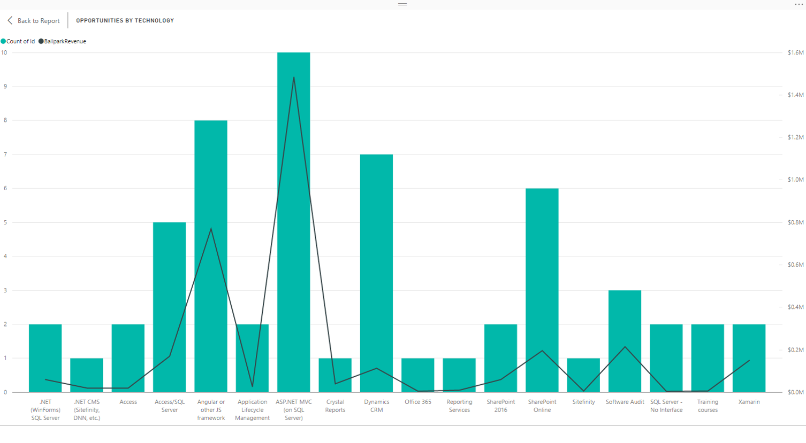
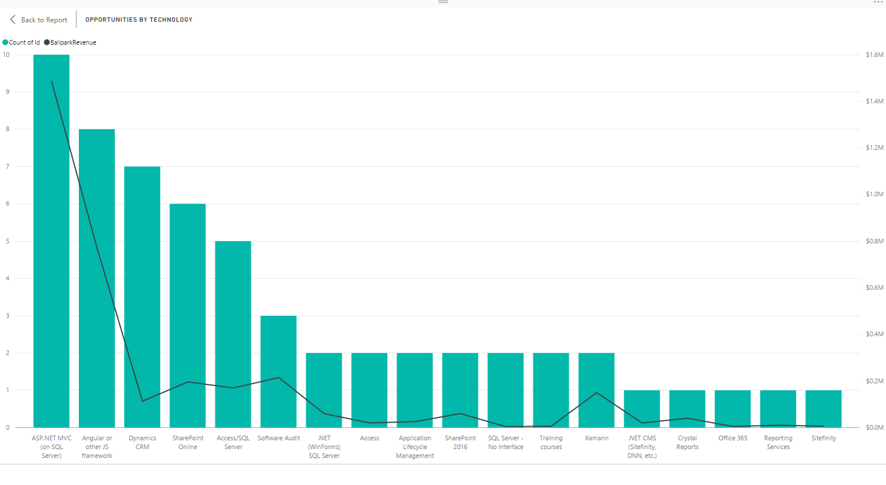

The default sort order for most visualizations is alphabetical, but you should almost always change this.

<!--endintro-->

::: bad
Alphabetical sorting is really only good if you're specifically looking for one item on the X axis, but it's terrible for seeing ranks, trends, or proportions.

:::

::: good

:::

