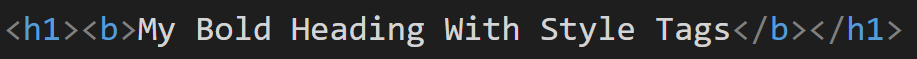
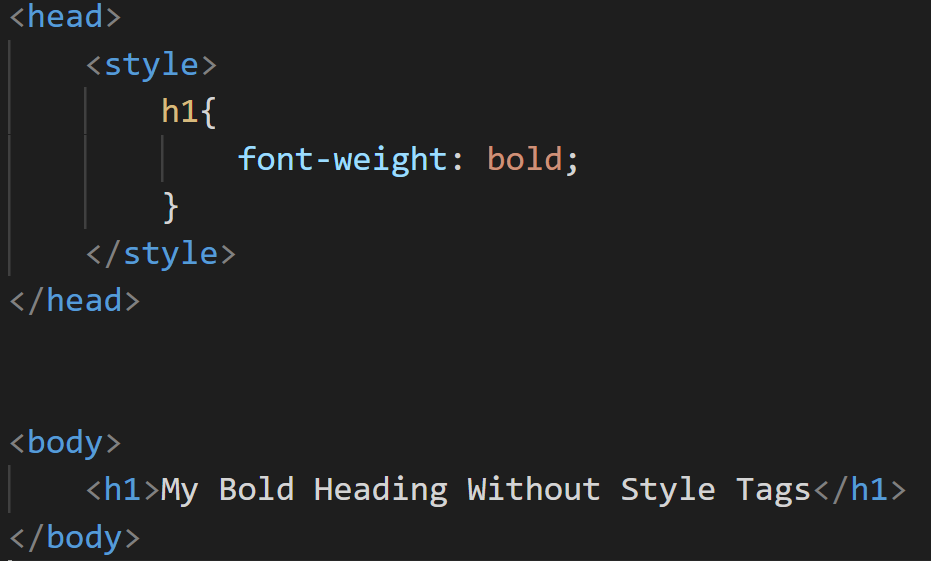

You should avoid any extra style tags in your heading text, because it is unnecessary and generates inconsistency. 

::: bad

:::

::: good

:::

<!--endintro-->

**Tip:** You can do all the styling via CSS.