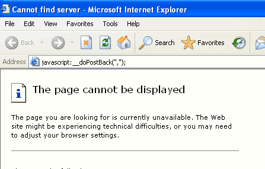

If we want to refresh and data bind the same page from client side, we can use the javascript function calls "__doPostBack". We shouldn't fire this post back in LinkButton. Otherwise, there will be an error. 
 <excerpt class='endintro'></excerpt> 
<dl class="image"><dt></dt><dd>Figure: Right click the link with __doPostBack event  ​
</dd></dl><dl class="image"><dt></dt><dd>Figure: New window with incorrect URL</dd></dl>

   
ASPX: <asp:Panel runat="server" ID="mUpdatePanel" OnLoad="mUpdatePanel_Load">  <asp:Label runat="server" ID="lblTime" />     <asp:GridView ID="gvList" runat="server" AutoGenerateColumns="false">  <Columns>  <asp:BoundField DataField="ID" HeaderText="ID" />  </Columns>  <Columns>  <asp:BoundField DataField="Name" HeaderText="Name" />  </Columns>  </asp:GridView>     ID:<asp:TextBox ID="txtID" runat="server"/>  Name:<asp:TextBox ID="txtName" runat="server"/> </asp:Panel> C#: protected void mUpdatePanel_Load(object sender, EventArgs e) {  lblTime.Text = DateTime.Now.ToLongTimeString();  ArrayList mList = (ArrayList)ViewState["List"];  if (txtName.Text.Length > 0)  {  Client mClient = new Client();  mClient.ID = Int32.Parse(txtID.Text);  mClient.Name = txtName.Text;  mList.Add(mClient);  ViewState["List"] = mList;  gvList.DataSource = mList;  gvList.DataBind();  } } 
<dd class="ssw15-rteElement-FigureNormal"> Sample Code​​​ </dd>
​​​<a href="javascript:__doPostBack('mUpdatePanel','');">Refresh</a> 
<dd class="ssw15-rteElement-FigureBad"> Bad Code​ </dd>
<input type="button" onclick="javascript:__doPostBack('mUpdatePanel','');" value="Refresh" /> 
<dd class="ssw15-rteElement-FigureGood"> Good Code​ </dd>
We have a program called <a href="https://www.ssw.com.au/ssw/CodeAuditor/">SSW Code Auditor</a> to check for this rule.​ 

​ 

