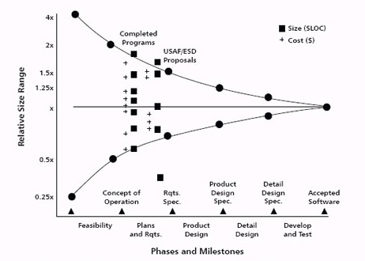
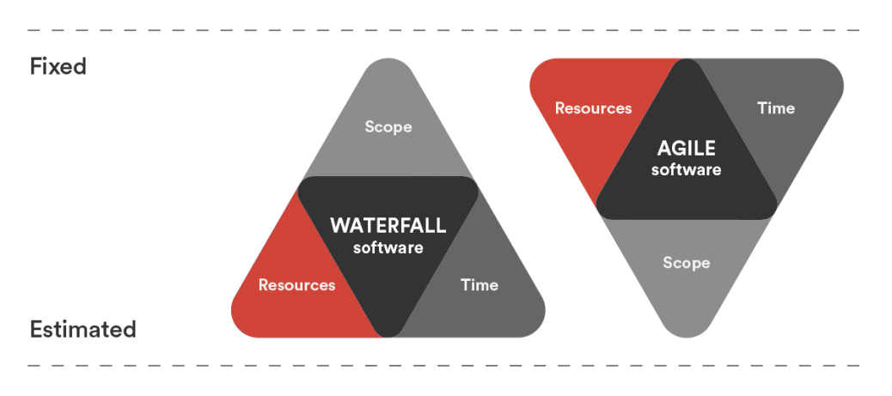

A fixed price - fixed scope project sounds good but doesn't always end up with the result either the client or the developers expect and sometimes the key players can end up disappointed.

There are 4 main reasons...

<!--endintro-->

1. You can’t predict the future
    * Waterfall project planning has been proven to not  deliver over 30 years of trying... The Gartner Group says 74% of failed software  projects in the last 2 years
    * See the Cone of Uncertainty to see the range of cost  change at different stages through a project:

**Figure: The cone of uncertainty in software cost and size estimation**

2. Changes requests are an extra cost and slow progress
    * It costs more because the fixed price part is fixed to  the original scope, not changes. So changes are a cost on top as changes are  new work and out of scope
    * Progress is slower because the change request cycle on  fixed scope consumes time and discussion of the nature of work and whether it  is in or out of scope
3. From experience during the development the client will  realize some items are not what they wanted, but they still pay due to fixed  price
    * When the client sees the real system implemented they  will often have better ideas and realize there are parts originally scope they  don’t meet their real needs but because it is in the contract they pay for them  even when they are not implemented, and pay extra for the changes to give what  they really need
4. In reality fixed-price fixed scope leads to lower quality in most cases
    * The lack of a running cost and instead a ceiling on  the cost will normally result in a low pressure project environment at the  start of the project and very high pressure to complete it only towards the end  of the project.  In that period of high pressure as developers are working  to hit the one big delivery it becomes tempting to them and sometimes even  expected by their management that they will cut corners

Instead,  the use of an iterative agile methodology like [Scrum](http://www.ssw.com.au/ssw/Consulting/Scrum.aspx) that provides constant progress  reporting and gives the client agility to implement the required features with  adjustments during the project, works to reduce the cost and also provides the  most important features paid as Time and Materials in a working solution  sooner.

