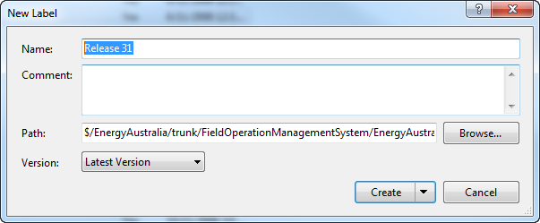
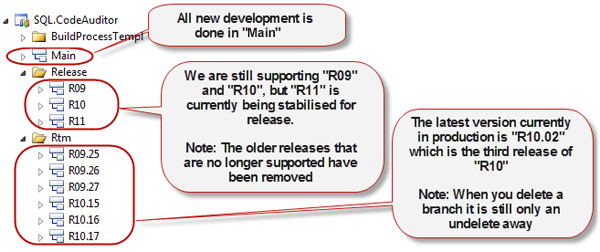

Although labels are useful they can be changed after they have been created with no way to tell that they have been changed.

<!--endintro-->

::: bad  
  
:::

::: good  
  
:::

**Fact #1** : Creating a branch of 1GB of source code does not increase the size of your database by 1GB. It just adds a bunch of pointers. Only the differences are actually stored.
**Fact #2** : When you delete a branch it is not really “deleted”, you are just ending the history. You can undelete at a later time.

**Tip** : Find deleted items by ticking “Tools | Options | Source Control | Visual Studio Team Foundation Server | Show deleted items in the Source Control Explorer”
