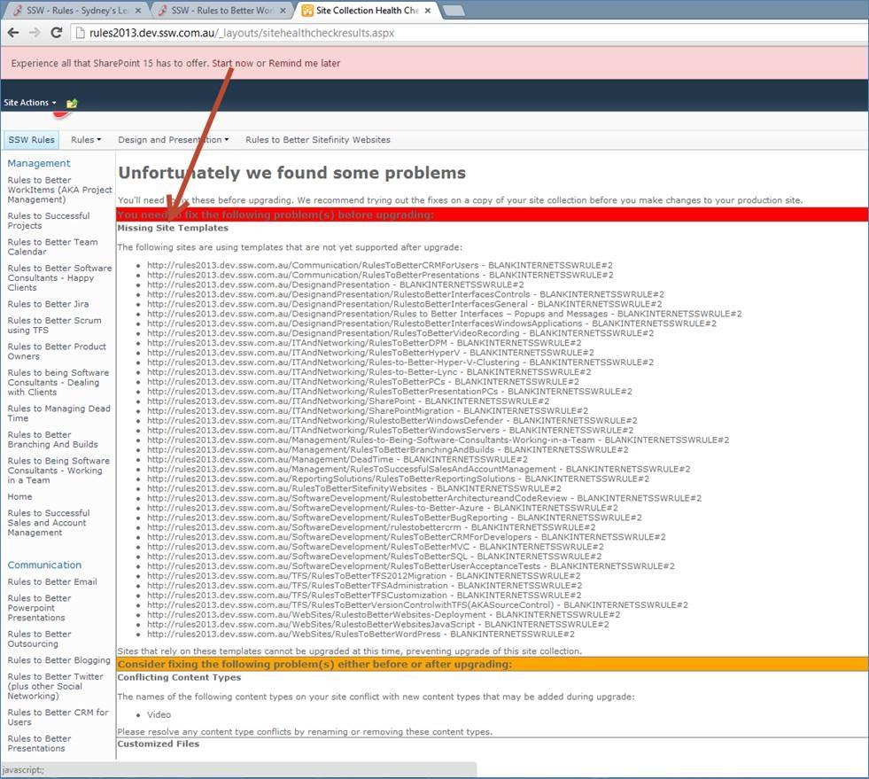
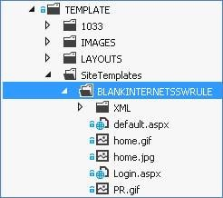
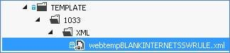

If you have “custom site template” for  your site, you can’t upgrade your site to the SharePoint 2013 UI unless you have a site template with the same name ready for new UI.

 

Figure:SharePoint will show you an error “Missing Site Templates” that prevents you from upgrading 

 <excerpt class='endintro'></excerpt> 

​To fix this issue

<ol><li>Upgrade your site template’s <strong>content </strong>files and <strong>definition </strong>XML file to SharePoint 2013 (refer to SharePoint 2013 default site template for details). </li><li>Package the site template’s <strong>content </strong>files to map location “<strong>{SharePointRoot}\Template\SiteTemplate</strong>”. </li></ol>

<blockquote style="margin:0px 0px 0px 40px;border:none;padding:0px;">
 

3.Package the site template’s <strong>definition </strong>XML file to map location “<strong>{SharePointRoot}\TEMPLATE\1033\XML</strong>”. 
</blockquote>

<blockquote style="margin:0px 0px 0px 40px;border:none;padding:0px;">
 
4.Deploy the package. </blockquote><blockquote style="margin:0px 0px 0px 40px;border:none;padding:0px;">
5.Try to upgrade to SharePoint 2013 UI again. 

 
</blockquote>

