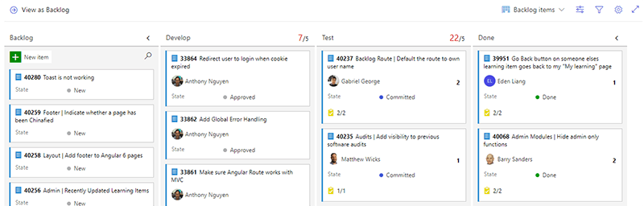

​​​​​​The lifecycle of a PBI can be broken down into 3 steps: 
 <excerpt class='endintro'></excerpt> 
<h3>1. Ready</h3><ol><li>Take the next PBI that was approved​ by the 
      <a href=/rules-to-better-product-owners target="_blank">Product Owner​​</a> </li><li>Is the PBI ready? Check your PBI against your 
      <a href=/have-a-definition-of-ready target="_blank">Definition of Ready​</a>. "Ready"​ PBIs must have Acceptance Criteria. A good Definition of Ready also encourages a test-first mentality in requirements e.g. Use Spec Flow (Given, When, Then) and/or create Test Cases and Test Steps first. </li><li>Attach and copy the Product Owner's email into the Acceptance Criteria (as per <a href=/do-you-attach-emails-to-the-pbi>Do you attach and copy emails to the PBI?​</a>​).​</li><li>Email notification to the Product Owner - 
      <a href=/when-you-use-mentions-in-a-pbi>use the @ mention rule</a> </li><li>Break down your PBI into tasks. </li><li>Don't forget to make a task for testing! (So that it is visible in the task board). Note: You can also 
      <a href="https://www.visualstudio.com/en-us/get-started/work/work-from-the-kanban-board-vs" target="_blank">customize the kanban board​</a> by adding a new column for testing, but we recommend adding a testing task to the PBI instead.</li></ol><dl class="badImage"><dt>
      ​</dt><dd>​​​Figure: Adding a new "Test" state. This is only visible in the Product Backlog and not the Sprint Backlog</dd></dl><dl class="goodImage"><dt> 
      
   </dt><dd>F​igure: Testing Task added to PBI. This is the board the team will use for 90% of the Sprint, so testing should be clearly visible here </dd></dl><h3>2. Code</h3><ol><li>From the PBI, create a new branch (so that your work is automatically tagged to the PBI) </li><li>On the Kanban Board, move your Task into "In Progress" </li><li>Checkout your new branch and start coding! </li><li>Code, code, code… (Red, Green, Refactor)</li><li>Push your changes, open a Pull Request </li><li>If you want feedback early, record a ​Done Video. E.g. Snagit </li></ol><h3>3. Done</h3>
Is the PBI "Done"? Check your Definition of Done, and then:
<ol><li>Open a Pull Request </li><li>Get another engineer in your team to do an "over the shoulder" check of the code</li><li>Use <a href=/do-you-do-exploratory-testing-2>Microsoft's "Test and Feedback" Chrome extension </a> to test the app </li><li>Make changes based on feedback (and then get more feedback)</li><li>Complete the Pull Request! Merge changes to master, this automatically deploys (to either Test, Staging or Prod based on process maturity)</li><li>Email notification to the Product Owner – send a 
      <a href=/dones-do-you-reply-done-and-delete-the-original-email>Done Email (reply to the original)​</a>. Big items should have a 
      <a href=/do-you-send-done-videos>Done Video​​</a></li><li>Check the Acceptance Criteria for notes about email attachments (as per 
      <a href=/do-you-attach-emails-to-the-pbi>Do you attach emails to the PBI?​</a>).​ </li></ol>​Congrats. Your PBI is now ready to be demonstrated during your Sprint Review! (Note: This is also the same process you follow for a Bug work item) 
<dl class="goodImage"><dt>
      ​ </dt><dd>Good Figure: This image includes all the important steps in a PBI lifecycle. Print this "<a href="/Documents/3StepsToAPBI.pdf">SSW 3 Step​s to a PBI pdf</a>" and put it on your 'War Room' wall </dd></dl>

