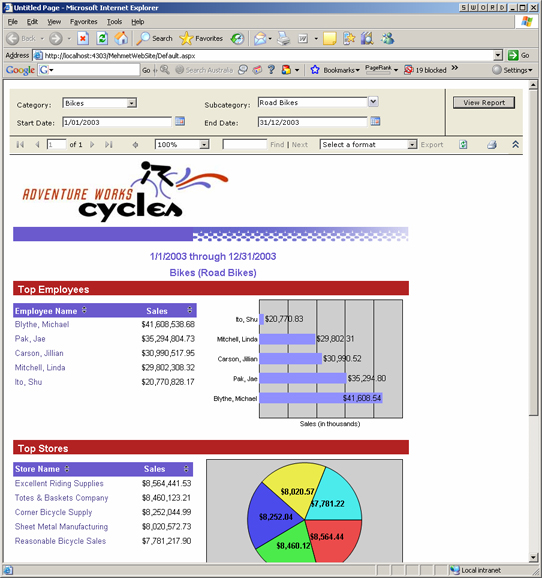
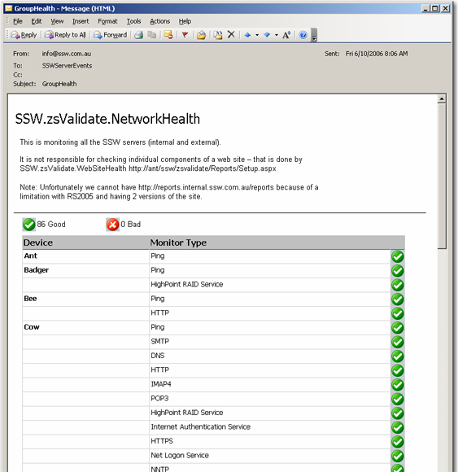
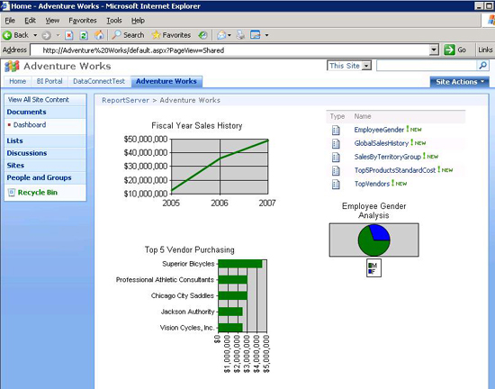

​The five user experiences of Reporting Services are:
<ul><li>Vanilla (Report Manager)</li><li>Website</li><li>Email</li><li>Windows</li><li>SharePoint​</li></ul>

 <excerpt class='endintro'></excerpt> 

​Figure: Vanilla user experience

 

​​Figure: Website user experience

Figure: Email user experience

 Figure: Windows user experience

  Figure: SharePoint user experience

