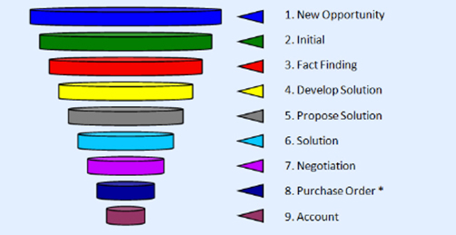
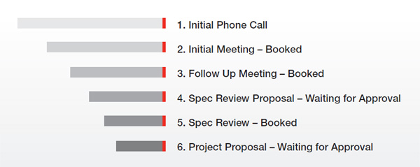

Any opportunity that has not yet been converted to a sale will be at one of the following 6 stages:

<!--endintro-->

1. Initial Phone Call

   * The client has made contact but no initial meeting has yet been made

2. Initial Meeting – Booked

   * You've arranged an initial meeting and it's booked in

3. Follow Up Meeting – Booked

   * In some cases, more than one initial meeting may be required before work or speccing commences

4. Spec Review Proposal – Waiting for Approval

   * After the Initial Meeting, if the work requires it, a Specification Review is proposed

5. Spec Review – Booked

   * The specification phase has been approved and booked in

6. Project Proposal – Waiting for Approval

   * After the Spec Review, the client has been given a proposal for a chunk of work. Once this is approved, the opportunity is closed as won

The old Sales Pipeline was 9 steps, whereas this new one is 6 steps.

::: bad

:::

::: good

:::
