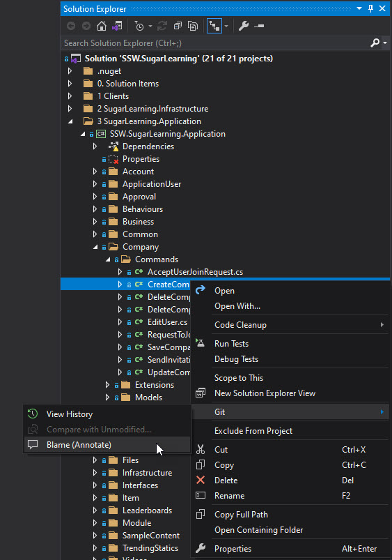

Source control is the backup of your code, as well as your change history to track changes. 
 With the source control (we use TFS), we can share project code and cooperate with other team members. Using it allows us to track changes, compare code, and even roll-back if required. Moreover, it keeps our code safe that is the most important.   
<!--endintro-->

** 

(or find the guy) to understand his thoughts before deleting/changing someone elses code** 

::: greybox
Don't just fix the problem, see who caused the problem and correct them.
**- Adam Cogan** 
:::

::: greybox
 **Using VS Code? There are 2 awesome extensions to see history:** 
#1 [GitLens — Git supercharged](https://marketplace.visualstudio.com/items?itemName=eamodio.gitlens)
#2 [Git History](https://marketplace.visualstudio.com/items?itemName=donjayamanne.githistory)

:::
