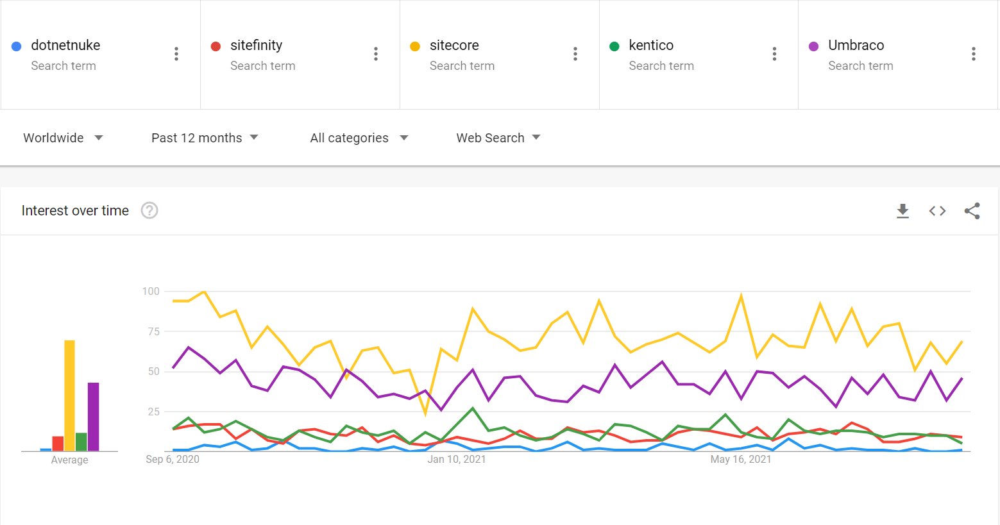
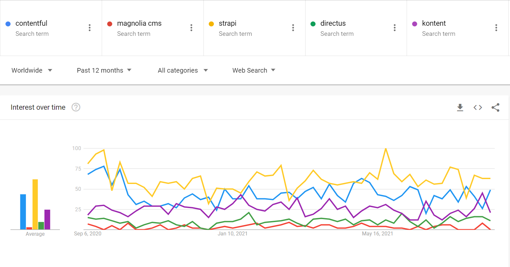

You don’t want to build solutions from scratch, so take what business value you can from a CMS: don't reinvent the wheel.

> A CMS allows business users to build and manage websites without having to write any code.

### Top 6 CMS vendors of 2021 by Market Share (including eCommerce and websites)

 

* WordPress
* Joomla
* Drupal
* Shopify
* Squarespace
* Wix

Source: https://www.isitwp.com/popular-cms-market-share/

### Top 5 CMS vendors for Enterprise websites (.NET based)

 

* SiteCore ($$ - approx $50k per year - pricing non-transparent)
* Kentico Xperience (Formerly Kentico EMS) ($$ - approx $20k per year per website - https://xperience.io/pricing)
* Sitefinity ($$ - approx $40k per year - pricing non-transparent)
* Umbraco (Open source) ($ - https://umbraco.com/umbraco-cms-pricing/)
* DotNetNuke - DNN (Open source) (pricing non-transparent)

Source: https://theonetechnologies.com/blog/post/top-5-dot-net-based-cms-platforms
\
\

**Figure: Google trends of the above .NET CMSs. The leading (but most expensive) is SiteCore, and in second is Umbraco (which is much cheaper). [Current trend information for these products](https://trends.google.com/trends/explore?q=dotnetnuke,sitefinity,sitecore,kentico,Umbraco)**

### Top 5 Headless CMS of 2021

 

* Kontent (Kentico) ($$ - https://kontent.ai/pricing)
* Contentful ($$ - https://www.contentful.com/pricing/)
* Strapi (open source) (free / $ enterprise plan - https://strapi.io/pricing-self-hosted)
* Directus (open source) ($ - https://directus.io/pricing/)
* Magnolia (pricing non-transparent)

Source: <https://www.izooto.com/blog/best-headless-cms-2021>
\
\

**Figure: Google trends of the above Headless CMSs. The leading is the open-source Strapi, which is inexpensive, but not as feature rich as Contentful (second) and Kontent (third). [Current trend information for these products](https://trends.google.com/trends/explore?q=contentful,magnolia%20cms,strapi,directus,kontent)**

## Headless CMS vs Traditional CMS

\
**Source**: <https://www.udig.com/digging-in/traditional-cms-vs-headless-cms/>

A Traditional CMS is a monolith, which means it has both a front-end and back-end. It uses server side technology like PHP (Wordpress,  Joomla, Magento) or ASP.Net (DNN, Umbraco, Sitefinity) and a single database. All pages are served by one or many backend servers.

A Headless CMS deals strictly with the content. Created content is accessed via Application Programming Interfaces (APIs), which gives you full flexibility on how you build the front-end for your website. 

For example, you can use a Headless CMS with a super fast Static Site Generator (SSG): see the rule on the [best static site tech](https://www.ssw.com.au/rules/do-you-use-the-best-static-site-tech-stack).

> Traditional CMSes like Sitecore and Kentico Xperience have their place, especially if you have no developers and you’re comfortable with serious vendor lock-in. Headless CMSes and static sites for the win.
-Adam Cogan

### ✅ Traditional CMS - Pros

 

* **Simple and fast** - for setup and maintenance 
* **No developers needed for small-medium projects** - for larger websites or a complicated CMS (e.g. SiteCore), this may become necessary.
* **Simple to control look and feel** - using available themes and templates
* **Large community support**
* **Out of the box integrations** - payments, social media, etc.

### ❌ Traditional CMS - Cons

 

* **Performance is not amazing** - the frontend is coupled with the backend.
* **Does not scale very well** - all pages render server side, so you will need more servers if you have lots of traffic.
* **Locked-in** - content is only available on browsers and not on native mobile apps.
* **Limited flexibility** - you are limited to themes and templates, e.g. if you want to build a multi-step form.
* **You need developers with particular CMS skills** - If you have a big website or are using complicated CMS features, you will need CMS developers - e.g. for SiteCore or Sitefinity.
* **It is not an API first solution**

### ✅ Headless CMS - Pros

 

* **Super fast** - fast initial load time when using Static Site Generator (SSG).
* **Scales very well** - when using Static Site Generator, and the frontend can be cached via CDN.
* **Ultimate flexibility with how to use content** - can use a Single Page Application (SPA), Static Site Generator (SSG) or even native mobile apps. Not restricted by themes, templates or vendor, and you can have multiple frontends with 1 headless CMS backend.
* **Many options to build frontend** - NextJs, HUGO. Gatsby, React, Angular, etc. This makes it easier and cheaper to find developers.
* **Easy publishing** - The same content can be published to different platforms at the same time (website, web app, native mobile app).

### ❌ Headless CMS - Cons

 

* **You need frontend developers** - the CMS only handles the backend content.
* **Greater overhead** - to maintain the code base, DevOps, etc.
* **Limited preview functionality** - Content creator can’t preview exact content (Netlify CMS helps).

## Headless CMS Comparison: Kontent vs Contentful

 

Let's compare two popular CMSs.

Terms:

**Content Modelling** - the ability to model your website components, and see how they are used in your website.

**Collections** - allows you to manage content dependent on your business and geographical structure. This eliminates the use of silos, which make it more difficult to manage your data.

**Website optimisation** - See the Kontent's useful [docs](https://docs.kontent.ai/tutorials/develop-apps/optimize-your-app/seo-friendly-content) on this topic.

 

| **Name** | [Kontent](https://kontent.ai/) (Recommended) - [Video](https://www.youtube.com/watch?v=wZLw3UKNQk8) (3 mins) | [Contentful](https://www.contentful.com/) - [Video](https://www.youtube.com/watch?v=TNE9OAXP4R0) (1 min) |
| - | - | - |
| **In-Context Editing** | ✅ [Info](https://kontent.ai/blog/in-context-editing-the-best-way-to-update-website-content) | ❌
| **Hierarchy** | Projects \| Environments \| [Collections](https://kontent.ai/blog/in-context-editing-the-best-way-to-update-website-content) | Spaces \| Environments
| **Personalized Experiences** | ✅ via [Uniform](https://uniform.dev/uniform-for-kontent/) | ✅ via [Frosmo](https://frosmo.com/frosmo-with-contentful/)
| **SSO and MFA** | ✅ | ✅ 
| **GraphQL Support** | Soon: [October 2021](https://portal.productboard.com/kontent/2-kontent-public-roadmap/c/119-allow-developers-to-query-data-more-efficiently-using-graphql) | ✅
| **Localization** | ✅ | ✅ 
| **Content Modelling** | ✅ | ✅
| **Unlimited Content Types** | ✅ | ❌ 
| **Content Collaboration** | ✅ + [Simultaneous Editing](https://kontent.ai/blog/better-real-time-collaboration-with-simultaneous-editing) | ❌ 
| **Task Management** | ✅ [Info](https://kontent.ai/blog/better-content-operations-for-enterprises-and-developers) + better functionality | ✅ [Info](https://www.contentful.com/help/tasks/)
| **Workflows** | ✅ | ✅                                                                             
| **Website Optimisation** | ✅ | ❌
| **Roadmap Transparency** | Better: [feature release roadmap](https://portal.productboard.com/kontent/2-kontent-public-roadmap/tabs/7-upcoming-public-releases) | Good: [Info](https://www.contentful.com/whats-new/)                                   
| **Australian Compliance** | ✅ stored in an Australian Azure Data Center | ❌ stored in a United States AWS Data Center
| **Dev/Staging/Prod Data Migration** | Prod only by default - Add migration script and pipeline | Prod only by default - Add migration script and pipeline |
| **Email Campaigns** | Use 3rd party best of breed tool e.g. MailChimp | Use 3rd party best of breed tool e.g. MailChimp |
| **User Tracking e.g. Leads, funnels** | External CRM e.g. Salesforce Pardot, Dynamics 365 Marketing | External CRM e.g. Salesforce Pardot, Dynamics 365 Marketing |
| **Statistics** | External Analytics e.g. Google Analytics | External Analytics e.g. Google Analytics |
| **CDN** | Fastly | Cloudfront |
| **Developer Friendly** | ✅ | ✅ |
| **Pricing** | [Premium](https://kontent.ai/pricing): $30,000 pa (cheaper with scaling) | [Team](https://www.contentful.com/pricing/): $24,000 pa (with Compose + Launch) |

> Assuming you want enterprise features, Kontent is preferred as the Headless CMS of choice over Contentful.

Source: https://kontent.ai/compare/contentful

## Dead CMSs

 

* Microsoft SharePoint for public sites
* CommunityServer.org