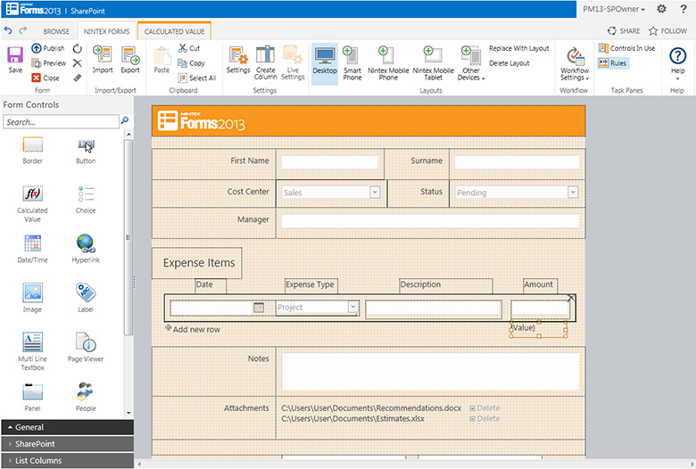
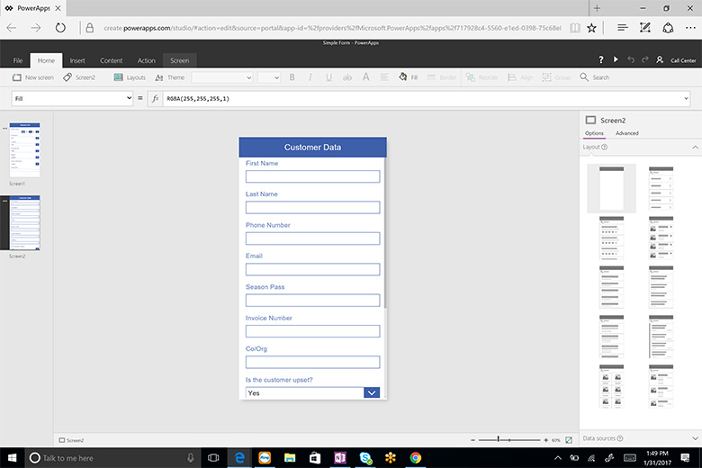

You should use PowerApps for your forms.

<!--endintro-->
<dl class="badImage">&lt;dt&gt;&lt;/dt&gt;<dd>Figure: Bad example - Using Nintext</dd></dl><dl class="badImage">&lt;dt&gt;&lt;/dt&gt;<dd>Figure: Bad example - Using Infopath</dd></dl><dl class="goodImage">&lt;dt&gt;&lt;/dt&gt;<dd>Figure: Good example - Using PowerApps</dd></dl>
