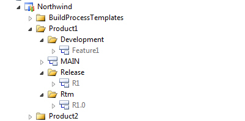
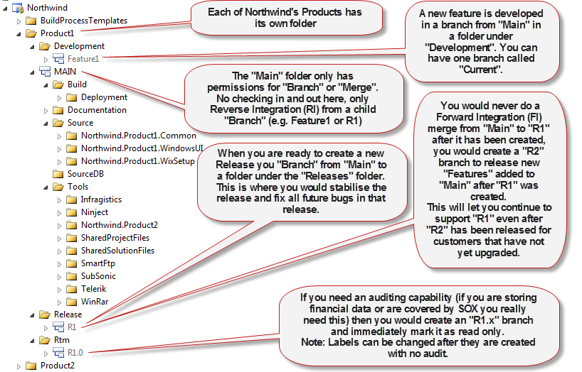

Having a good folder structure in version control allows everyone to know where everything is without even having to look.

<!--endintro-->

::: greybox
/northwind
 /trunk
 /branches (or shelvesets)
  /experiemental-feature1
 /releases (or tags)
  /1.0.0.356
:::
::: bad
Figure: Bad example - SVN conventions are a dated and ignore releases, hotfixes and Service Packs  
:::

Trunk is the old way, Main is the new way as per the branching guidance, and it is the way that Microsoft does things.

::: good

:::

**More Information:**

