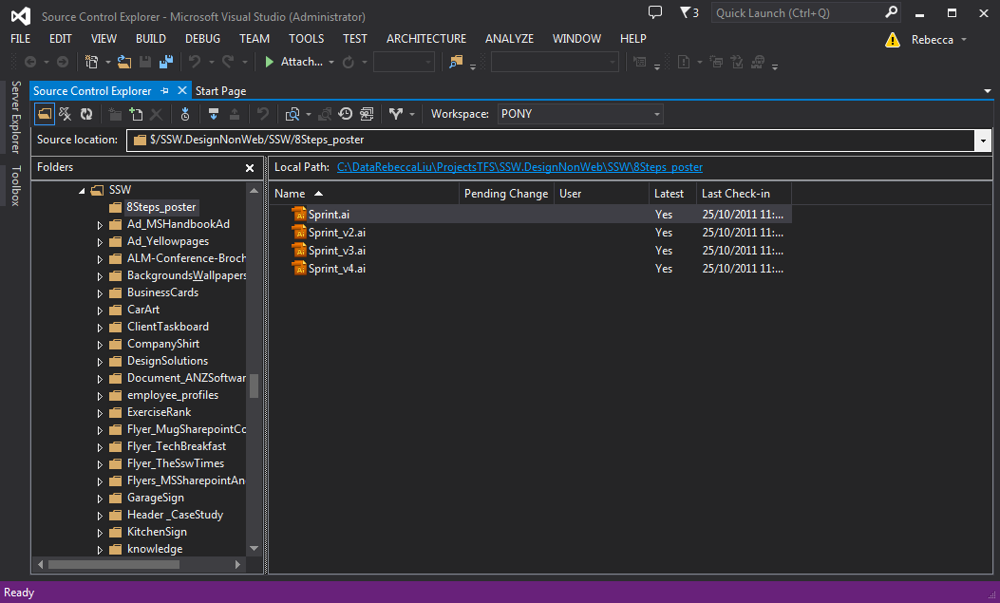
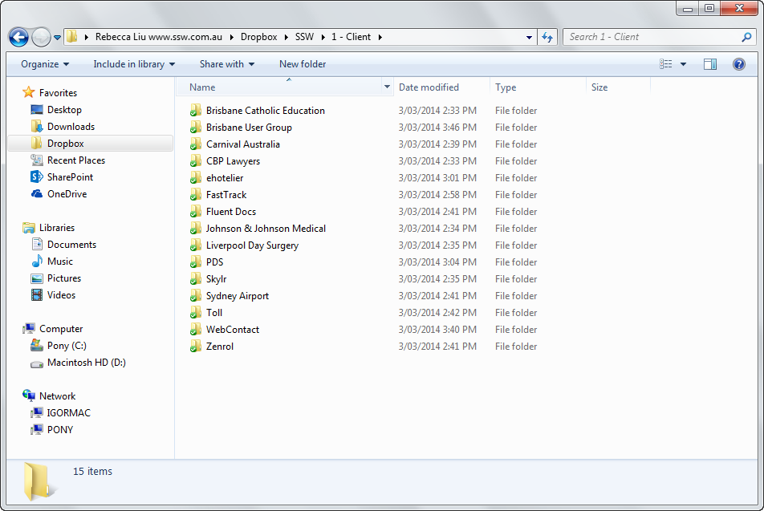
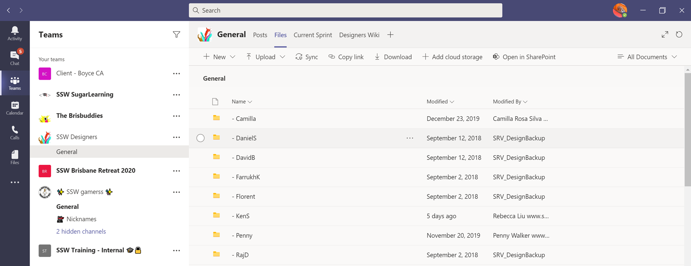

Design files should never be stored in Azure DevOps (was VSTS/TFS) or any other development file system.

<!--endintro-->
<dl class="badImage">&lt;dt&gt; 
       
   &lt;/dt&gt;<dd>Figure: Bad example – Azure DevOps (was VSTS/TFS) takes too long to set up and too slow to use </dd></dl><dl class="goodImage">&lt;dt&gt;
       
   &lt;/dt&gt;<dd>Figure: Good Example – Dropbox or OneDrive </dd></dl><dl class="goodImage">&lt;dt&gt;
       
   &lt;/dt&gt;<dd>Figure: Good Example – OneDrive and Teams </dd></dl>

::: greybox
🇨🇳 Google Drive and Dropbox don’t work in China, so SSW prefers to use OneDrive.

:::

For developers, see [Do you know where to keep your files?](/_layouts/15/FIXUPREDIRECT.ASPX?WebId=3dfc0e07-e23a-4cbb-aac2-e778b71166a2&TermSetId=07da3ddf-0924-4cd2-a6d4-a4809ae20160&TermId=2860239f-9812-414a-ad42-6174c928cbb0)
