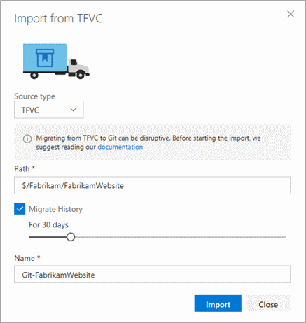

Git has become the defacto standard for version control systems. It's distributed and decentralized and promotes working disconnected as default. It also takes away the pain of branching and merging and has a built in code review system with pull requests. Everybody should be using Git, and if you're not, you should be migrating the Git using one of the below tools. 
<ul><li>VisualStudio.com - Import Repository </li><li>Git-Tf </li><li>Git-Tfs (recommended) </li></ul>

 <excerpt class='endintro'></excerpt> 
<h3 class="ssw15-rteElement-H3">VisualStudio.com - Import Repository </h3>
VisualStudio.com gives you the ability to import from a TFVC repository into a new Git repository.  

 
<dd class="ssw15-rteElement-FigureBad">Bad Example - Built in tool has several limitations </dd>
If you don't care about source control history, then this inbuilt tool is the easiest to use. It has the limitations of:

<ul><li>180 days of history </li><li>No branches </li></ul>
<strong>TIP - </strong>Use this if you don't care about source control history 
 
<h3 class="ssw15-rteElement-H3">Git -Tf  </h3><a href="https://gittf.codeplex.com/">Git-Tf</a> is an open source command line tool  that works cross platform and use the Java TFS SDK. This tool is useful for migration if you're not on a Windows environment. This tool is not maintained and has issues with migrating branches. 
 

To see how to use this to migrate see <a href="https://chriskirby.net/blog/migrate-an-existing-project-from-tfs-to-github-with-changeset-history-intact">"Migrate an existing project from TFS to Git with changeset history intact" from Chris Kirby </a> 

<strong>TIP - </strong> Use Git-Tf if you don't have a Windows environment 

<h3 class="ssw15-rteElement-H3">Git-Tfs ( Recommended) </h3>

<a href="https://github.com/git-tfs/git-tfs">Git-Tfs</a> is an open source command line tool that uses the .NET TFS SDK to interface between Git and TFVC. It has the following advantages over the other tools: 

<ul><li>Actively maintained </li><li>Good support for branches </li><li>Author mapping </li><li>Migrates all history  </li></ul>
Follow the <a href="https://github.com/git-tfs/git-tfs/blob/master/doc/usecases/migrate_tfs_to_git.md">migration guide</a> to import from TFVC to Git and then proceed with <a href=/do-you-know-what-to-do-after-migrating-from-tfvc-to-git>the after migration steps </a>. To help you do a smoother migration, you can refer to this <a href=/tfs-master-do-you-have-a-report-to-see-who-has-not-checked-in>tool </a>.  

 

