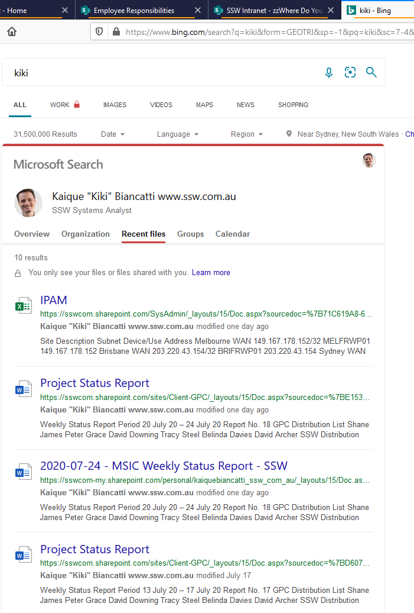

In Bing, if you are logged in to your work account, you can easily see your recent files!
The same works for your work colleagues.

<!--endintro-->
<dl class="goodImage">&lt;dt&gt; 
       
   &lt;/dt&gt;<dd>Good Example: Bing - Find your files faster by just searching on Bing</dd></dl>
**Suggestion to Microsoft:** Put a checkbox "Show thumbnails" like Delve.

In a slower way, you can go to Delve to see this information with a different UI with big images.
<dl class="badImage">&lt;dt&gt;
      
       
   &lt;/dt&gt;<dd>Bad Example: Delve - Is harder to get to and the UI doesn't offer a summary view like Bing</dd></dl>
