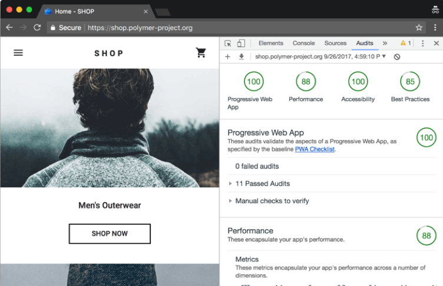

Lighthouse is an open-source tool built into Google Chrome that can audit for performance, accessibility, progressive web apps, and more. Allowing you to improve the quality of web pages.

<!--endintro-->

You can run Lighthouse:

* In Chrome DevTools
* From the command line
* As a Node module

It runs a series of audits against a URL and then it generates a report on how well the page did. From there, you can use the failing audits as indicators on how to improve the page. Each audit has a reference doc explaining why the audit is important, as well as how to fix it.
<dl class="goodImage">   &lt;dt&gt;
      
   &lt;/dt&gt;<dd>Figure: Good Example - Google Chrome Lighthouse is showing 100%  </dd><h3 class="ssw15-rteElement-H3">Lighthouse Level 1: Throttling Off </h3>For applications intended for use on a desktop and from within a well-connected office (such as your intranet or office timesheet application) test with throttling turned off. <h3 class="ssw15-rteElement-H3">Lighthouse Level 2: Throttling On </h3>
To see how well your website would perform on low-spec devices and with poor internet bandwidth, use the throttling features. This is most important for high volume, customer-facing apps.  

  
  ::: good Figure: Good Example - Lighhouse can simulate slow netwrking and CPU when performing tests  :::  
 
<h3 class="ssw15-rteElement-H3">Lighthouse Level 3: Automated testing </h3>
For business-critical pages, you may want to automate Lighthouse testing as part of your Continuous Delivery pipeline. This blog post by Andrejs Abrickis shows how to configure an Azure DevOps build pipeline that performs Lighthouse testing. <a href="https://medium.com/%40andrejsabrickis/continuously-audit-web-apps-performance-using-google-s-lighthouse-and-azure-devops-3e1623372f79">https://medium.com/@andrejsabrickis/continuously-audit-web-apps-performance-using-google-s-lighthouse-and-azure-devops-3e1623372f79</a>   

 
</dl>
