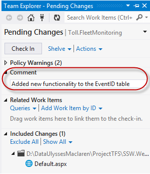

 
The goal is simple, accurate hours and good comments. 

​There are&#160;4 ways developers can keep track of what they have been working on when the time comes to enter their timesheets&#58;
 

<ol><li>Fully electronic - Enter your timesheets daily 
      <strong>(recommended)</strong></li><li>Keep details in OneNote or Notepad++</li><li>Jot it down on paper (i.e. a physical diary)</li><li>Copy and paste your TFS check ins. The comments from these check-ins make great comments for your timesheet entries</li></ol>
<strong>Tip #1&#58;&#160;​</strong><a href="http&#58;//www.ssw.com.au/ssw/TimePRONET/">SSW TimePRO​</a> automatically pulls TFS check-ins in for you.

   <strong>Tip #2&#58;</strong> If you're using Microsoft 
   <a href="/scheduling-do-you-know-how-to-book-developers-for-a-project">CRM for bookings</a>, you will have an appointment every day in your outlook that you can use to know what client you worked for.

   <strong>Tip #3​&#58;</strong> As a last resort, you can copy and paste the subject from your emails to the client. Check your&#160;Sent Items to see what work you completed in the day. This should be simple if you're sending 
   <a href="/dones-do-you-include-useful-details-in-your-done-email">&quot;Done Emails&quot;</a>.
<h3>Why have we moved away from Physical Diaries?</h3>

Back in the day, people used to keep physical diaries to keep track of what work they did, and then they'd get the client to sign it each day they were on site to ensure they were communicating. This is now all covered by TFS check ins, CRM bookings, Outlook emails, and 
   <a href="/methodology-do-you-do-daily-scrums-(aka-stand-up-meetings)">Daily Scrums</a>​ to ensure communication.
<dl class="badImage"><dt>
      
   </dt><dd>Figure&#58; Bad Example – Physical Diaries are no longer needed</dd></dl><dl class="goodImage"><dt> 
       
   </dt><dd>Figure&#58; Good Example – TFS Check in comments are a very accurate recording of what work was done</dd></dl> ​

