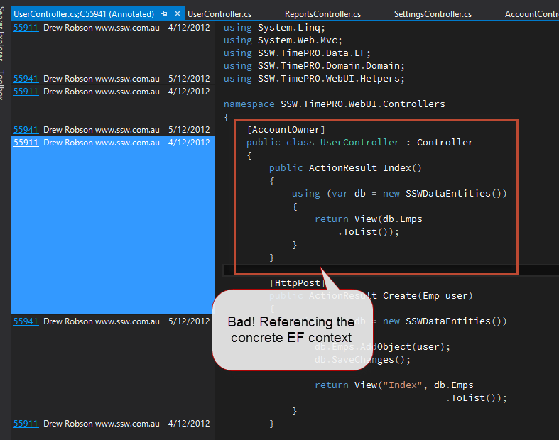
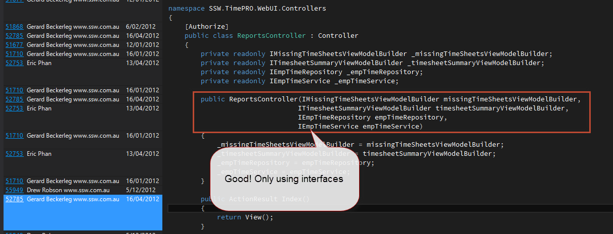

Appropriate use of design patterns can ensure your code is maintainable.

<!--endintro-->

Always code against an interface rather than a concrete implementation. Use dependency injection to control which implementation the interface uses.

For example, we could implement Inversion of Control by using the Dependency Injection pattern to decrease the coupling of our classes.

In this code, our controller is tightly coupled to the ExampleService and as a result, there is no way to unit test the controller.

[This example is from the blog: http://www.devtrends.co.uk/blog/how-not-to-do-dependency-injection-the-static-or-singleton-container]

`public class HomeController{    private readonly IExampleService _service;    public HomeController()    {      _service = new ExampleService();    }         public ActionResult Index()    {        return View(_service.GetSomething());    }}`

Figure: Bad example - Controller coupled with ExampleService

`public class HomeController{    private readonly IExampleService _service;         public HomeController()    {      _service = Container.Instance.Resolve<IExampleService>();    }         public ActionResult Index()    {        return View(_service.GetSomething());    }}`

Figure: Bad example - 2nd attempt using an Inversion of Control container but \*not\* using dependency injection. A dependency now exists on the Container.

This is bad code because we removed one coupling but added another one (the container).

`public class HomeController{    private readonly IExampleService _service;         public HomeController(IExampleService service)    {      _service = service;    }         public ActionResult Index()    {        return View(_service.GetSomething());    }}`
Figure: Good example - code showing using dependency injection. No static dependencies. 
Even better, use Annotate so you can enlighten the developer.

**Figure: Bad Example - Referencing the concrete EF context**

**Figure: Good Example - Programming against the interface**

It is important to know when the use of a pattern is appropriate.  Patterns can be useful, but they can also be harmful if used incorrectly.
