Data Entrees should be able to use your data entry form with ease. It should follow the flow that they are familiar with.

<!--endintro-->

::: bad  
  
:::

### 1. Multiple Form Instances

Imagine, while the Sally is entering a Quote on the Quote Form, they receive a Phone call from a client needing a new Quote. The user will not want to close the current Quote, because they are 1/2 way through it.

As we saw in the example above, Sally needs to open multiple instances of the same form. A reputable example for this is Microsoft's Outlook. When you are 1/2 way through an email, and you chose to start writing another, Outlook makes it convenient by placing every email you open in the taskbar. The figure below illustrates this.

::: good  
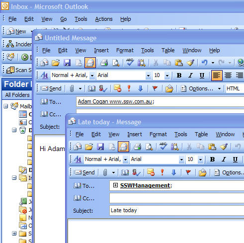  
:::

::: good  
  
:::

A method of implementing this is through New and Delete buttons on the form.

New and Delete buttons should appear, in a toolbar for example, docked to the top.

The figure in Data Entry Drill Downs below illustrates this:

::: good  
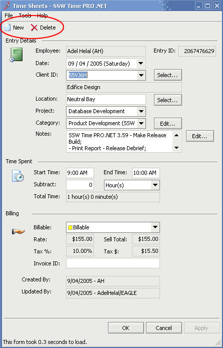  
:::

The Delete button resides there to make sure that Sally has seen the record before she deletes it. The New button should instantiate a new data entry form in add mode (as compared to "edit"), leaving the current one in the background.

It can be argued that navigation is required in a data entry form. As an option, a good navigation system will navigate through a subset of records (ideally records which are search results). The idea of navigating through all records can be tedious, and most of the time useless.

#### However there is a problem

Do you open the same record with two different instances of the form? For example, if attempt to open a form instance for editing a Quote from the database, then while editing you open up another form instance for the same Quote. Besides the fact that there will be loss of data, and dirty reading, this is a very confusing interface.

A possible solution for this issue is to implement a form manager.

The "form manager" will keep track of every instance opened. So in our example, the second time we try to open the same Quote for editing, the "form manager" will recognize that there is a form currently being edited that Quote, and would select that form.

### 2. Form states and how to respond to them

The form is to be aware of the data state. If the data is dirty:

* The Apply button would be enabled until the record is saved
* The OK button would simply save the record and close the Form
* The Cancel button would pop up a dialog (shown in the figure below) asking to save changes;

If the user decides to save, it should save the record and close the form.
If No, then close the form without saving.
If Cancel, then return back to the dirty form.

::: good  
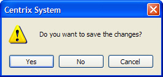  
:::

### 3. Searching on the data entry

Do not add buttons for searching on the data entry form, create a new form for search, through which you can open new instances of the form. The convenience of the search capability on the form will be overlooked as it makes the form more crowded. Another issue which can arise is if Sally searches for a criteria which returns multiple records, she cannot look at all those records. She can only open one at a time, navigating through them. The solution to the search dilemma is to create a new search form, which is shown in the figure below. The search form will allow multiple criteria, will not over crowd the data entry form, and will show you all the results that your search has retrieved.

::: bad  
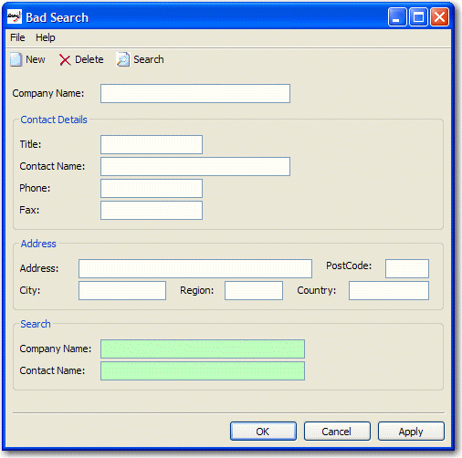  
:::

::: good  
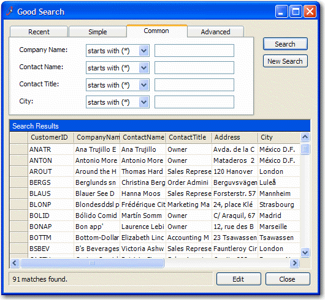  
:::

### 4. No Delete Button for sub forms

When including a sub form in your main form (as shown in figure below), the only options the user should have are "New" and "Edit". When "Edit" is clicked, another data entry form is opened to edit selected record. In this data entry form, you will have a "Delete" button on the toolbar. This saves the user from making mistakes and forcing them to see the record before deleting.

::: good  
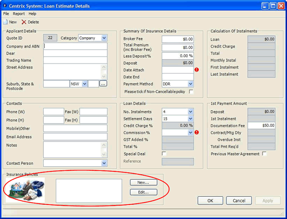  
:::

### 5. Validation

Most fields required validation. There are three types of validations:

* Required Field - the field should be filled in
* Formatting - the field must be in a correct format. e.g. currency or date
* Logical - the field needs to pass some validation tests in the business layer

To show an error, display an error provider icon next to the field on the right. An example of this is shown in the figure below.

Validation must not be done on TextChanged, this may chew the processor if it is a logical validation. It can also give unpleasant results, e.g. when entering -6.00, as soon as the '-' is entered the validation control would turn on.

Validation for Required fields must be done in the validating event.

Validation for format should be done in parse/format methods.

Validation for Logic should be done in Validated, since it must be entered if required, and in correct format.

The reason for the above validation placement is that these events run in the following order:

* Validating
* Parse/Format
* Validated

::: good  
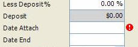  
:::

**Do not** show a message box after every error in validation. You may show a message box as an error summary when an OK or Apply is clicked. Make sure you warn the user that there is an error on the form when they attempt to save.

### 6. Relevant Menus

Make sure that the menu items are relevant to the current form. The main idea is that we don't want to show the user any dummy menu items. However, this may become complex when a base form (containing the menu) is inherited. Access to menus in the base form must be granted (maybe through properties), so that each menu can be customized according to each child form.

::: bad  
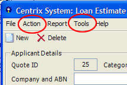  
:::

::: good  
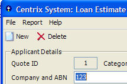  
:::

In the above example, there are a couple of unused menus that have been inherited from the base form and not set to invisible.

### 7. Field Formatting

Ensure that the data is displayed in correct format. For example, when presenting a percentage data in a field, make sure it is displayed as '% xx.xx'.

To accompany formatting, you must also create a parse function for putting the correct value back in the database.

**Note:** This can be difficult for data bound fields, and in that case you will have to handle the parse and format event of the Field's Binding object. An example of handling these events is shown below.

``` vb
    Dim controlBinding As Binding = New System.Windows.Forms.Binding(propertyName,dataSource, dataMember)
    Dim controlBinding As Binding = New System.Windows.Forms.Binding(propertyName,dataSource, dataMember)
    AddHandler controlBinding.Format, AddressOf DecimalToCurrencyString
    AddHandler controlBinding.Parse, AddressOf CurrencyStringToDecimal
    controlToBeBound.DataBindings.Add(controlBinding)

    Private Sub DecimalToCurrencyString(sender As Object, cevent As ConvertEventArgs)
    ' The method converts only to string type. Test this using the DesiredType.
    If Not cevent.DesiredType Is GetType(String) 
    Then
        Exit Sub
    End If
    ' Use the ToString method to format the value as currency ("c").
    cevent.Value = CType(cevent.Value, Decimal).ToString("c")
        End Sub

    Private Sub CurrencyStringToDecimal(sender As Object, cevent As ConvertEventArgs)
    ' The method converts back to decimal type only.
    If Not cevent.DesiredType Is GetType(Decimal) 
    Then
        Exit Sub
    End If
    ' Converts the string back to decimal using the static ToDecimal method.
    cevent.Value = Decimal.Parse(cevent.Value.ToString, NumberStyles.Currency, nothing)
    End Sub
```

**Figure: Code - Code for Handling Parse and Format Events for Data bound Control**

The Binding is created and added to the Data-Bindings of the Control all in one line in Visual Designer in VS.Net. Do not use Visual Designer to data-bind if you will be handling the Parse and Format events. You will have to create the handlers yourself.

### 8. Created/Last Updated By Fields

With all database entries, there are always some fields that are used over and over again. For example, these fields may be created date, created by, last updated date, updated by, etc.

A common UI to use for these fields can be seen in the example below. What we do is create a user control that is identical across all projects/UI.

::: bad  
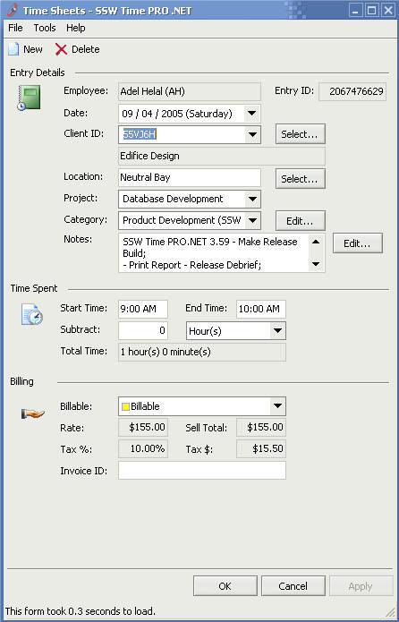  
:::

::: good  
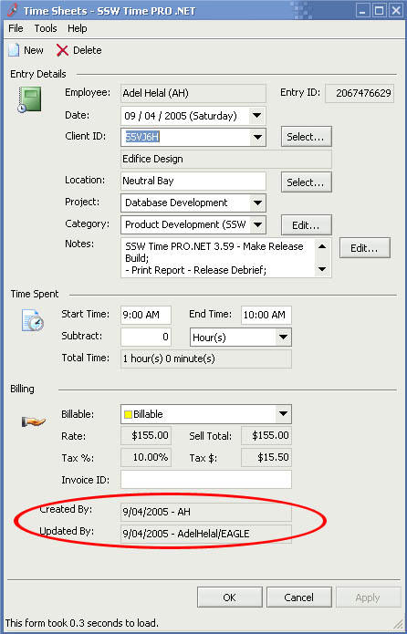  
:::

An example of how to set the values for this user control is shown below.

``` vb
    updatedBy.CreatedDate = .DateCreated
    updatedBy.CreatedBy = .EmpCreated
    updatedBy.UpdatedDate = .DateUpdated
    updatedBy.UpdatedBy = .EmpUpdated
```

**Figure: Code - Code for Setting values for User Control**

Databinding is also available to be used with this user control.

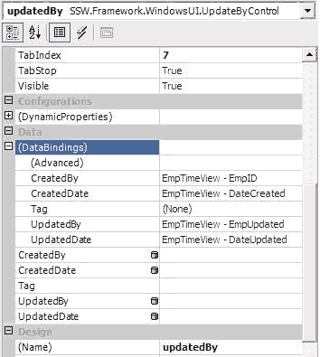  

### 9. Minimum Defaults

In many situations, there is a need for field Defaults. These Defaults can be extracted from the Database for example. When a new form is opened ensure that only necessary Defaults are loaded. By Default some decimal fields will become 0.0, but make sure they are set to blank because they may be required fields.

### 10. Resizing

Is the form resizable? What happens if the user resizes and/or maximizes the form?

Data entry forms, and forms containing List View controls, should be resizable. Use either anchoring or docking, or a combination, to handle window resizing.

Restricting the user from resizing or maximizing the form is not recommended.
