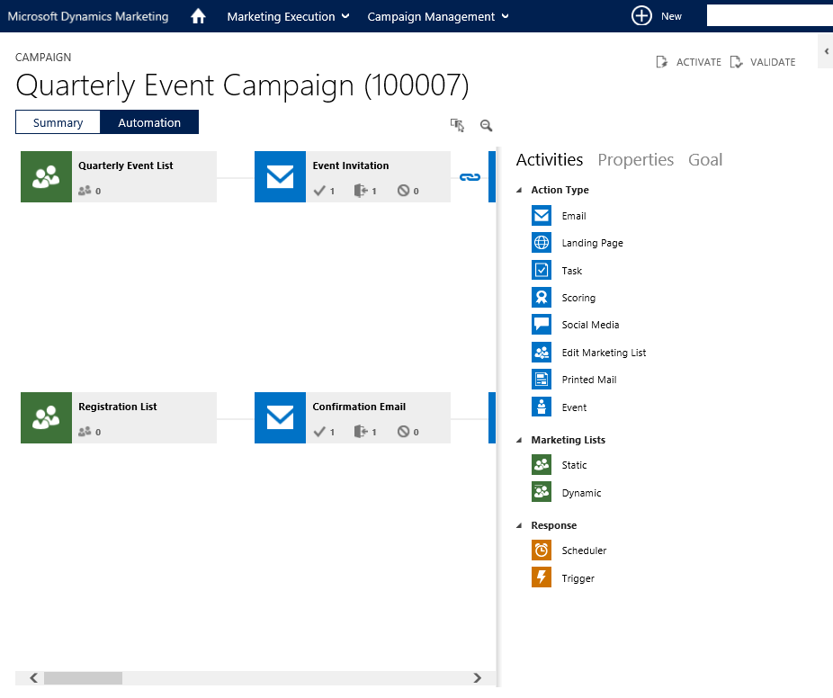

The Marketing Automation inside Microsoft Dynamics Marketing is very powerful and easy to use. You have the following options when creating these: 
<!--endintro-->

**Action Type**

* Email
* Landing Page (used to collect data and make leads)
* Task
* Scoring (leads created through MDM can be scored to rank them appropriately)
* Social Media
* Edit Marketing List (e.g. adding people to a “follow up later” list)
* Printed Mail
* Event

**Marketing Lists**

* Static (stored and manipulated in MDM)
* Dynamic (the result of an on the spot query)

**Response**

* Scheduler (e.g. to delay x days before doing the next step
* Trigger (e.g. if someone goes to an event)

<dl class="image">&lt;dt&gt;
      
   &lt;/dt&gt;<dd>Figure: Simple drag and drop interface for creating automated marketing workflows</dd></dl>
