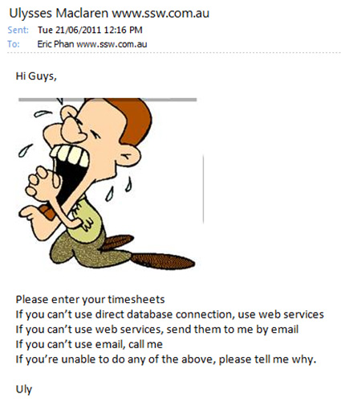
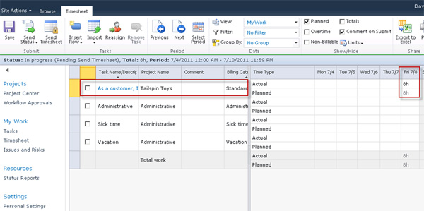

Timesheets have always been the bane of developers, with them trying every excuse under the sun to avoid them and project managers trying everything to convince them to enter them.

<!--endintro-->

  

The main problem is timesheet entry is often difficult, time consuming and requires double entry (e.g. into different systems TFS and invoicing system).

Project Server 2013 offers a solution that integrates with TFS work items.

::: good  
  
:::

::: greybox
If you want a timesheeting solution built on top of Microsoft CRM and Azure DevOps, See [www.SSWTimepro.com](https://sswtimepro.com/)
:::
