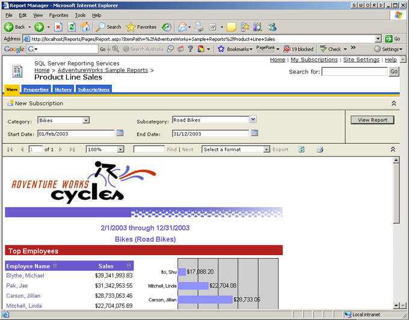
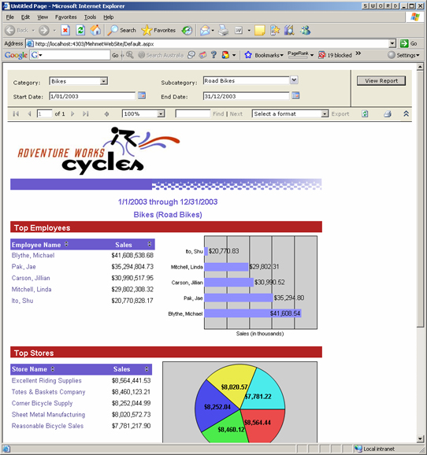

<!--endintro-->

The 5 user experiences of Reporting services are...

- Vanilla

 
<strong>Figure: Example of Vanilla user experience</strong>

- Website

 
<strong>Figure: Example of Website user experience</strong>

- Email

 
<strong>Figure: Example of Email user experience</strong>

- Windows

 
<strong>Figure: Example of Windows user experience</strong>

- SharePoint

 
<strong>Figure: Example of SharePoint user experience</strong>