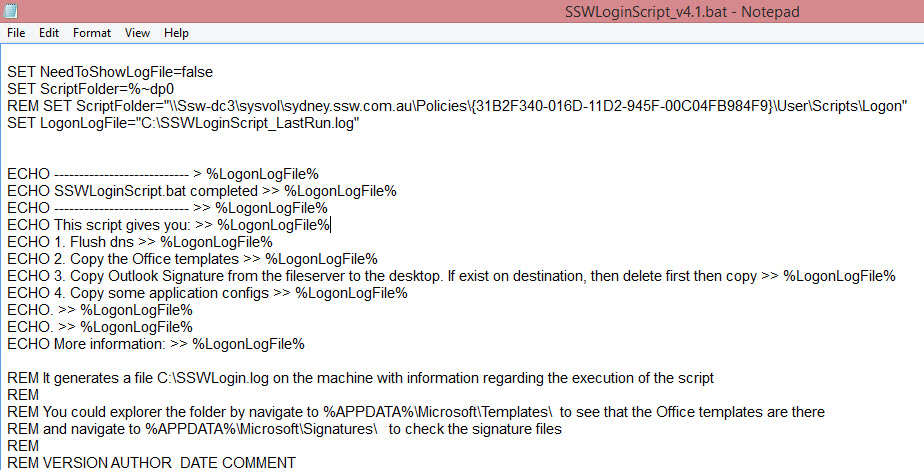
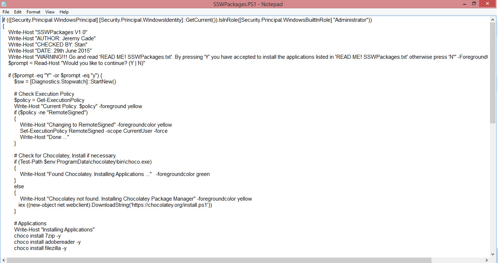
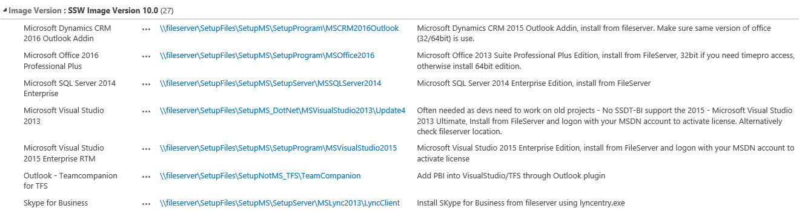
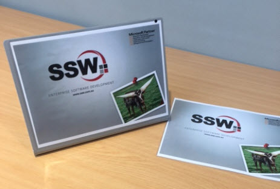

Your developers should be using Windows 10 for a [number of reasons](http://au.pcmag.com/windows-10-preview-release-date-news-features/35511/feature/10-reasons-to-upgrade-to-windows-10), the primary one being it is faster than Windows 8.
The next step is to get the Standard Operating Environment (SOE) installed. You have a few choices:

* Manually - it can take over a day to install your favorite 20 or so apps
* Windows Image - there is an overhead of maintaining the .WIM file as software changes - RECOMMENDED FOR LARGE COMPANIES 100+ NON TECHNICAL STAFF
* Use a package manager (eg. chocolatey/Winget) - RECOMMENDED FOR SMALLER COMPANIES &lt;100

<!--endintro-->

### Use a package manager ([Chocolatey](/do-you-use-a-package-manager))

Assuming that Windows 10 is already installed, then get your SOE installed fast by following these steps:

1. Logon and configure Windows 10
2. Install Windows Updates
3. Join laptop to the Domain (or run a Logon-Script.bat to get printers, Word templates, etc. Contact SysAdmin to join laptop to the domain)
4. Install and run a Chocolatey script to get most of the software
5. Install all rest of the standard Software that does not support Chocolatey \[SSW Only]   
6. In case you lose your laptop, it is a good idea to stick a business card to the bottom
7. For branding reasons, stick your company sticker to the laptop 
    









8. If you are preparing the machine for someone else or migrating an old PC, you could send an email based on the template below. Don't forget to change the names where necessary:
    

Hey Ana, 

Your new computer is ready. ⭐️  

```
* Machine name is COBRA
* Model: ThinkPad X1 Carbon Gen8
* Operating System: Windows 10 Enterprise installed and activated.
```

 **Done** - I have followed an SSW Rule: [https://rules.ssw.com.au/do-you-know-the-quickest-way-to-get-your-windows-10-soe-up-and-running](/do-you-know-the-quickest-way-to-get-your-windows-10-soe-up-and-running) and this included: 

```
* Data - I have copied the data files from your old PC (MountainGoat) to your new C: drive
* Branding - A SSW sticker has been added
* Power adapter - I labeled it for easy recognition
* Underneath - I stuck your business card in case it gets stolen
```

 **Done** - then I followed a SugarLearning Item: https://my.sugarlearning.com/SSW/items/8159/pc-install-and-configure-your-laptop and this included: 

```
* Software - Installed all your software via Chocolatey
* Software - Fully installed WIndows Updates for your laptop
* Software - Used the built-in app Updater (if any) for your laptop model (e.g. Dell Update, HP Smart) to update all firmware and software automatically
* Printer - Added the main office printers
```

 **Done** - then I followed a SysAdmin SugarLearning Item: https://my.sugarlearning.com/SSW/items/13220/snipe-it-asset-management and this included:

```
* Asset - Added the asset to our asset management tool, Snipe-IT: https://snipe.ssw.com.au/hardware/593
* Underneath - I added a QR Asset Tag (look here if you ever need to know your computer name)
```

Now I need you to do (we can do this together if you are stuck, just give me a call 🕺) 

```
1. Now login and check Microsoft - Teams App, Outlook
2. Now login and check Google - Chrome will bring back your bookmarks
3. Plugin external monitors - Configure your screens
4. Run the Login Script - Follow [Logon - Do you have a company-wide Word template?](https://www.ssw.com.au/rules/have-a-companywide-word-template)
```
