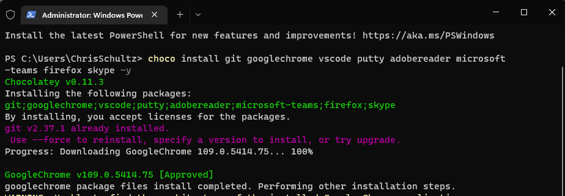

Your developers should be using the latest version of Windows for security, speed, and the latest features.

The next step is to get the Standard Operating Environment (SOE) installed. You have a few choices:

* **Manually** - it can take over a day to install your favorite 20 or so apps
* **Windows Image** - there is an overhead of maintaining the image as software changes - RECOMMENDED FOR LARGE COMPANIES, WITH COMPANY OWNED DEVICES
* **Use a package manager (eg. chocolatey/Winget)** - RECOMMENDED FOR SMALLER COMPANIES, AND ANYONE RUNNING BYOD

<!--endintro-->

### Use a package manager ([Do you use a package manager?](/do-you-use-a-package-manager))

Assuming that Windows is already installed, then get your SOE installed fast by following these steps:

1. Logon and configure Windows
2. (Optional) Join the Domain
3. Install Windows Updates
4. Install driver & firmware updates (Tip: use an app from the manufacturer, e.g. [Intel DSA](https://www.intel.com.au/content/www/au/en/support/detect.html))
5. Run a script to get printers, Word templates, etc.
6. Install and run a Chocolatey script to get most of the software
7. Install any software not supported by Chocolatey
8. In case you lose your laptop, it is a good idea to stick a business card to the underneath
9. For branding, stick your company sticker to the laptop - or even better, a custom skin - see [Do you brand your assets?](/brand-your-assets)

8. If you are preparing the machine for someone else or migrating an old PC, you could send an email based on the template below. Don't forget to change the names where necessary:

::: email-template
|          |     |
| -------- | --- |
| To:      | Bob Northwind |
| Subject: | Your new computer |
::: email-content  

### Hey Bob

Your new computer is ready ⭐️  

* Machine name: Bob-SurfacePro9
* Model: Surface Pro 9
* Operating System: Windows 11 Enterprise  

I have followed an SSW Rule: [ssw.com.au/rules/do-you-know-the-quickest-way-to-get-your-windows-soe-up-and-running](/do-you-know-the-quickest-way-to-get-your-windows-soe-up-and-running) and this included:

* Data - I have checked that your files are in OneDrive so that they will sync to your new computer
* Branding - It looks great with its custom laptop skin
* Power adapter - I labeled it for easy recognition
* Contact details - I stuck your business card underneath in case it goes missing
* Software - Installed all your software via Chocolatey
* Software - Fully installed WIndows Updates for your laptop
* Drivers/firmware - Used the app for your laptop model (e.g. Dell SupportAssist, Intel DSA) to update drivers and firmware
* Printer - Added the main office printers
* Asset - Added the asset to our asset management tool (e.g. Snipe)
* Asset - I added a Asset Tag with a QR code and computer name (look here if you ever need to know your computer name)

Now I need you to do (we can do this together if you are stuck, just give me a call 🕺)

1. Now login and check Microsoft - Teams App, Outlook
2. Check Google - Chrome will bring back your bookmarks
3. Plugin external monitors - Configure your screens
4. Run the templates script - Follow [Logon - Do you have a company-wide Word template?](/have-a-companywide-word-template)

:::
:::
