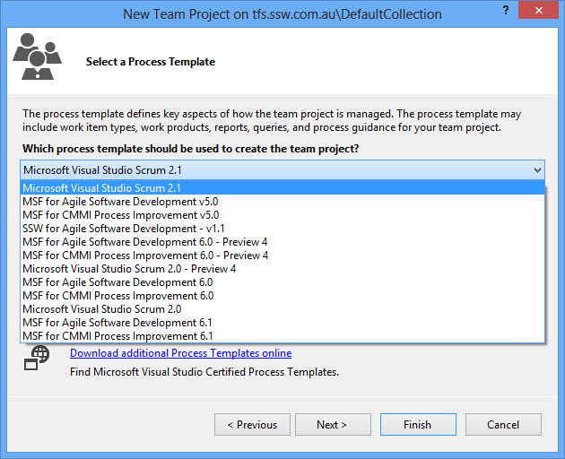

When you decide to use TFS 2012, you have the option to choose from different methodologies (aka. Process Templates).

Choosing the right template to fit into your environment is very important.

<!--endintro-->

  

It is recommended to use the top option, the Scrum one. If you think the built-in template is not going to fulfil your needs, customize it and create your own.

::: greybox
If you want help customising your own Process Template, call a TFS guru at SSW on [+61 2 9953 3000](tel:+61299533000).  
:::
