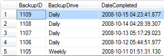

You need to log a record on success so you can check for backups that have failed. 

<!--endintro-->
<dl class="badImage">&lt;dt&gt;&lt;/dt&gt;<dd>Figure: Bad example - an email is sent on completion</dd></dl><dl class="goodImage">&lt;dt&gt;&lt;/dt&gt;<dd>Figure: Good example - a record is logged on completion</dd></dl>
Now you are able to be aware of missing backups. You can make automatically notification based on above table e.g. [by SQL Reporting Services data-driven subscription](https://www.ssw.com.au/ssw/KB/KB.aspx?KBID=Q1455840)
