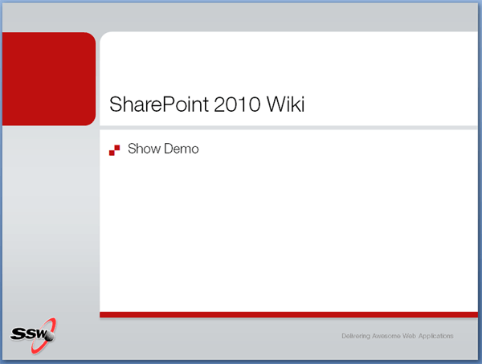
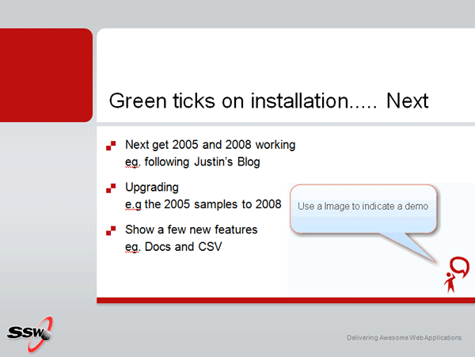

By placing a little visual cue on your slide, you can remind yourself to show a demo to the audience. Avoid displaying the word 'demo', because when out of time, presenters skip them and leave the audience felling ripped off.   
<!--endintro-->

The icon allows you to skip it when running short on time, without upsetting the audience.
<dl>    &lt;dt&gt; &lt;/dt&gt;
      ::: bad Figure: Bad example - demo text shown. The problem is if you run out of time you need to say "Sorry, let's skip that demo since I am short of time". Then the audience feels cheated :::  </dl><dl>    &lt;dt&gt; &lt;/dt&gt;
    <dd class="ms-rteCustom-FigureGood">Figure: Use an icon to indicate a "demo time"</dd></dl>
