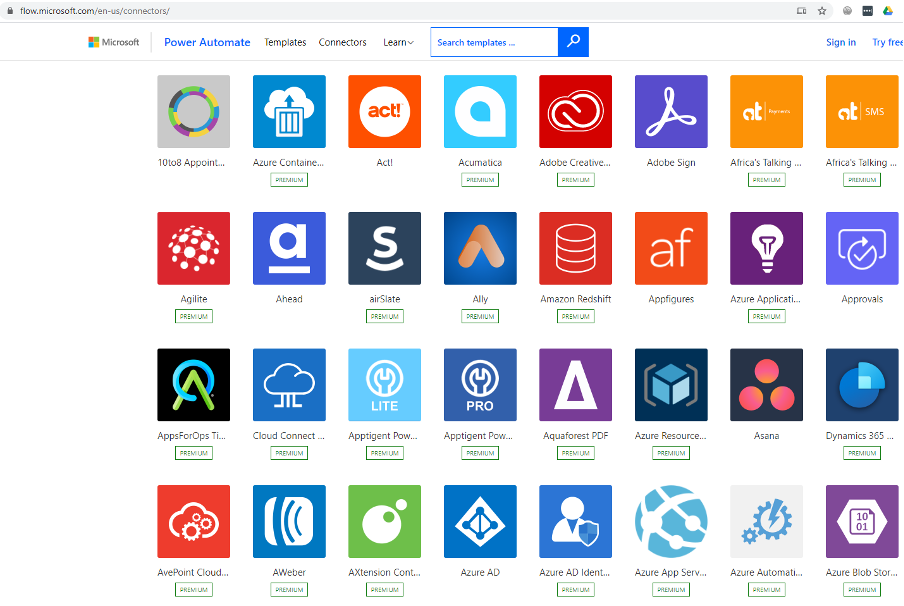

One huge advantage of a Canvas App has over a Model-Driven App is the number of connectors supported. As of October 2020, there are 300+ supported connectors. That means the hard work and the integration between your Canvas App and 300 plus external data sources is taken care of for you. On top of this, you can create custom connectors too. Want to see all the connectors currently available, go here: https://flow.microsoft.com/en-us/connectors/.

<!--endintro-->
<dl class="image">&lt;dt&gt;&lt;/dt&gt;<dd>Figure: Microsoft connector gallery is growing every day</dd></dl>
