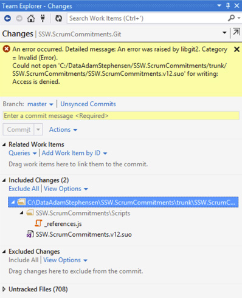
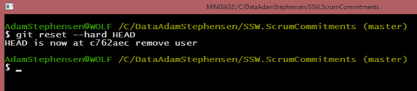

<h3>Git Reset – Discard your local changes and revert to your last Commit​</h3>
 <excerpt class='endintro'></excerpt> 
<dl class="image"><dt>
      
   </dt><dd>Figure: When trying to undo a change you will sometimes get errors. The answer is to exit Visual Studio and use the command line</dd></dl><dl class="image"><dt>
      
   </dt><dd>Figure: use ‘git reset --hard HEAD’ to throw away all your uncommitted changes</dd></dl> 
<strong>Note:</strong> A common cause of Visual Studio failing to undo changes is an incomplete .gitignore file. See 
<a href="http://adamstephensen.com/2014/05/13/update-your-gitignore/" target="_blank">http://adamstephensen.com/2014/05/13/update-your-gitignore/​</a> for more information. 

