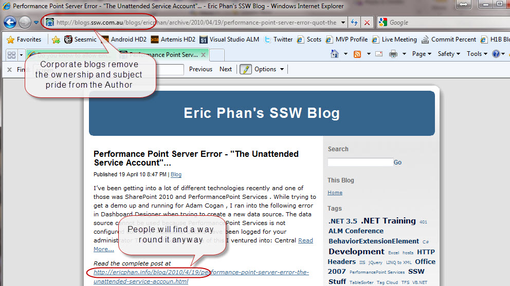

Technical people need a little bit of a free leash in order to be creative. This will benefit the company they work for by demonstrating how technical your staff are, by driving more traffic to your site, and making your staff happier.   
<!--endintro-->

 Figure: Bad example, employees must post to the corporate blog.

Figure: Good example, Allowing employees to post to their personal blog is a win, win situation. But they should do the Gold Plating after hours
 See: [Do you know to do the gold plating after hours?](/Pages/GoldPlate.aspx "http://sharepoint.ssw.com.au/Standards/Communication/RulesToBetterBlogging/Pages/GoldPlate.aspx")

Tip: Get your employees to add an “SSW” category to their blog so you can aggregate their posts onto the corporate site.
