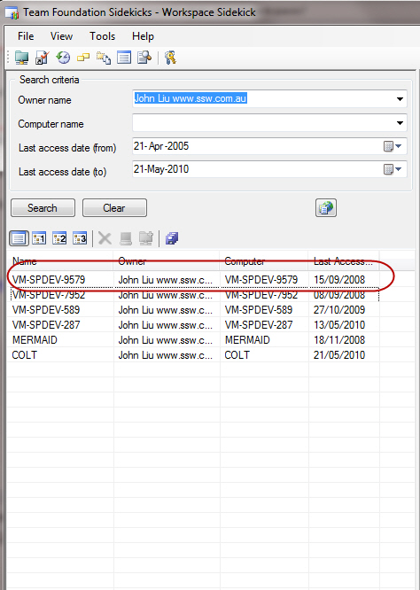

Every Workspace that exists on the server is another set of code that TFS has to check for checkouts. Worse you may have files checked out in that workspace that you will never see. 
<!--endintro-->

<dl><dd>Figure: John has not accessed many of these workspaces in years! Are they still current? </dd></dl>
Use the Workspace Sidekick in [Team Foundation Sidekicks](http://www.attrice.info/cm/tfs/index.htm) 
 at the end of every month to make sure you have not forgotten anything.
