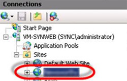

In theory WebDeploy can create a site for you when you deploy. The issue with this is that many settings are assumed.

<!--endintro-->

Always create the site before deploying to it, so that you can specify the exactly the settings that you desire. E.g. the directory where you want the files for the site to be saved, the app pool to use and the version of .Net.

<dl class="image">&lt;dt&gt;&lt;/dt&gt;
   <dd>Figure: Create the website in IIS</dd></dl>
