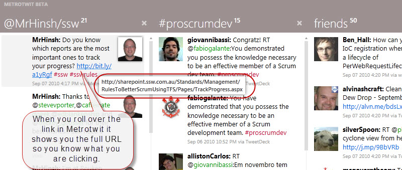

Readability of URLs is important, so you should consider making a short URL. However, it is not just making the length as short as possible - it should be friendly. 

<!--endintro-->

If you use a shortened link people can't see what they are clicking through to. In fact, this is what most spammers rely on:

::: greybox
http://twb.ly/1uJtUG
:::

Figure: Bad example - You don't know where this is going

When you can, take the more readable option:

::: greybox
http://twibbon.com/join/Scotland
:::

Figure: Better example - this link is sent in the clear as it is short enough

So you should only 'Auto Shorten URLs' when it is too long and you need the space.

However, it is becoming more prevalent for the software to support showing the full URL on rollover.
<dl class="goodImage">&lt;dt&gt;&lt;/dt&gt;<dd>Figure: Good example – the application does the heavy lifting for you </dd></dl>
