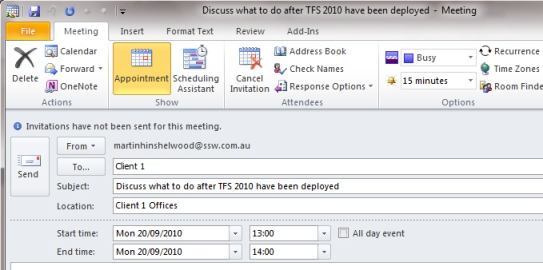
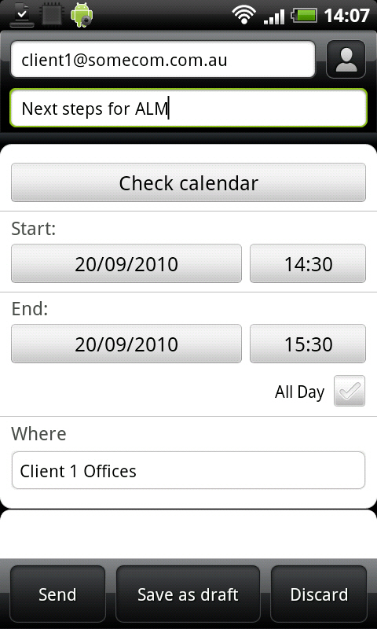

If you don’t make another appointment to see a client before you leave you may forget, and the client may forget. Make sure they are thinking about your next visit by booking the next appointment there and then, even if it is not for many months.  
<!--endintro-->

Use your mobile phone to book an appointment rather than remembering it later. If the systems are down, you may forget it entirely and that would be worse than never having made it.  

::: img-medium

:::

See [the best way to book yourself in using the CRM Service Calendar](/book-developers-for-a-project).
