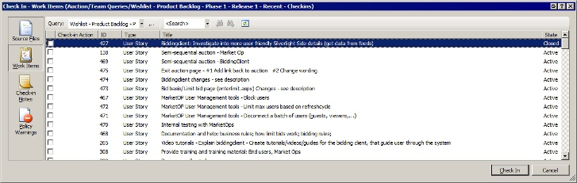
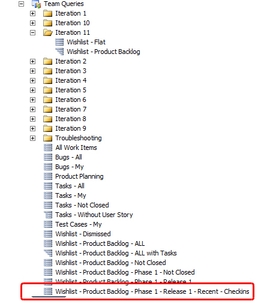
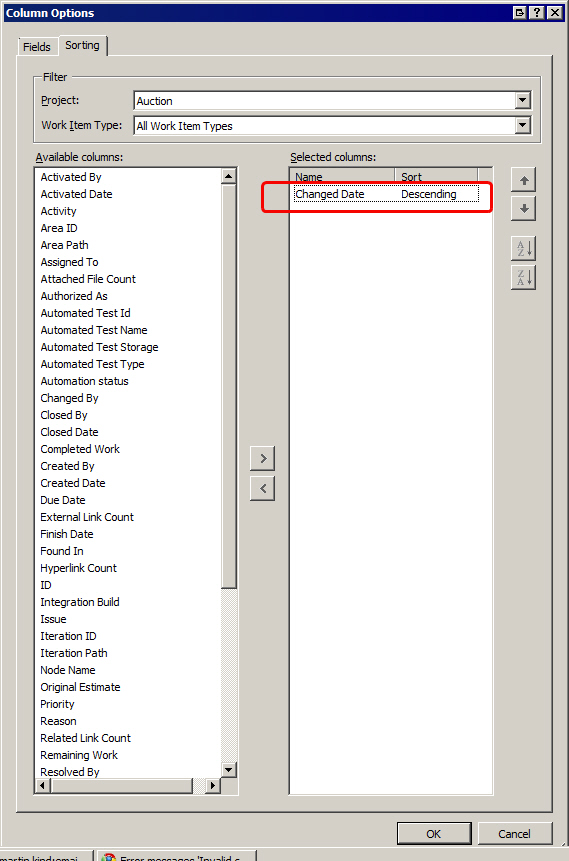

&lt;dt&gt;
&lt;/dt&gt;<dd>Figure: When you use Check-in policies you often will need to select a work item that you selected recently</dd><dd> </dd>
<!--endintro-->
<dl>&lt;dt&gt; &lt;/dt&gt;</dl>
Make this easy on yourself by adding a query 'Recent'1. Create a work item query that returns you the last changed work item <dl>&lt;dt&gt;&lt;/dt&gt;
<dd>Figure: Add a query just for your associated check ins </dd></dl>
2. Just copy the 'Tasks - My' query
3. Add the sort date of 'Changed Date' sorted by descending <dl>&lt;dt&gt;&lt;/dt&gt;
<dd>Figure: The query should be sorted by 'Changed Date' </dd></dl>
4. Use that query on your check ins and you find the relevant work item easily
