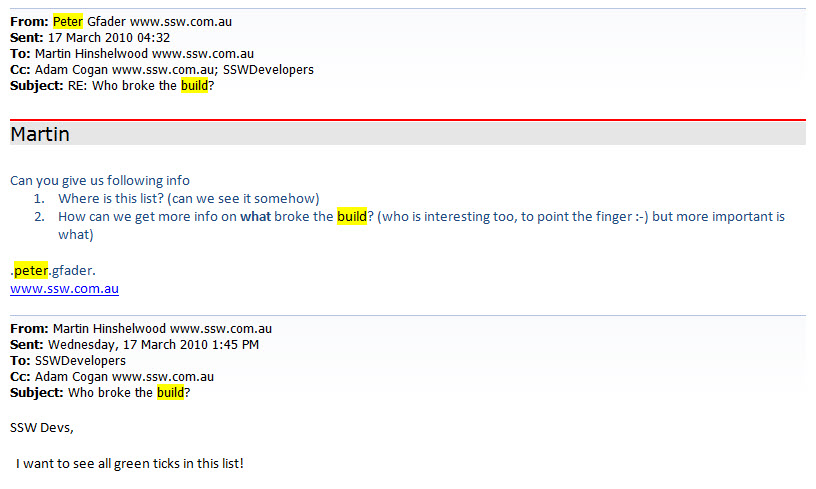
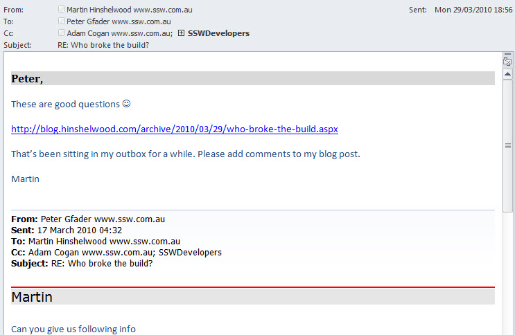

As long as there is nothing confidential or NDA in the content, any discussion point should be made public. Transparency is the name of the game. The more transparency you have between customers, management, and your technical employees the better. This fosters trust and a closer working relationship.

<!--endintro-->
<dl class="badImage">&lt;dt&gt;  &lt;/dt&gt;<dd>Figure: Bad example - This is just an email and is hidden from all those outside of the recipients. Any answer here would only be of use to those on the list. What if someone new to the company had the issue or someone outside of the company? </dd></dl><dl class="goodImage">&lt;dt&gt;&lt;/dt&gt;<dd>Figure: Good example - writing a blog shows both how you deal with mistakes encourages the wider community to contribute with the discussion</dd></dl>
So keep jewels from being left in your inbox. Remember that you are inviting replies, and that the gold in this process.

**Note:** If the discussion is not worth a blog post, then tweet it and link to the rule.
