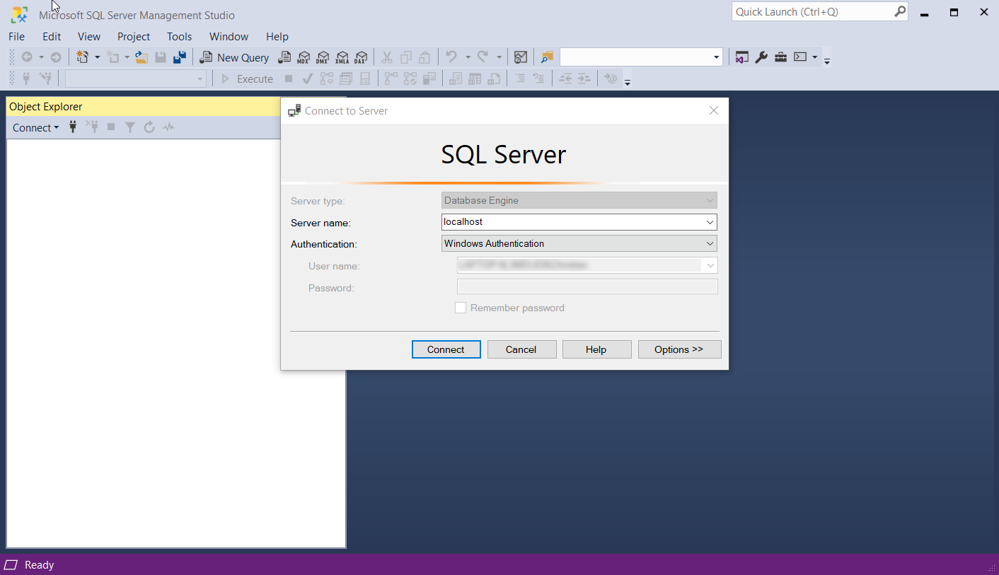
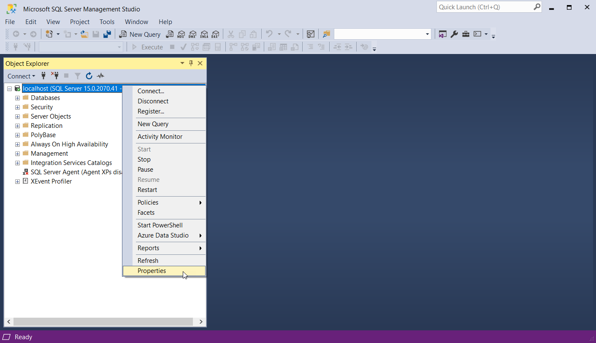
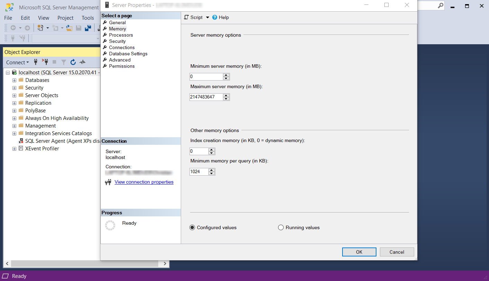
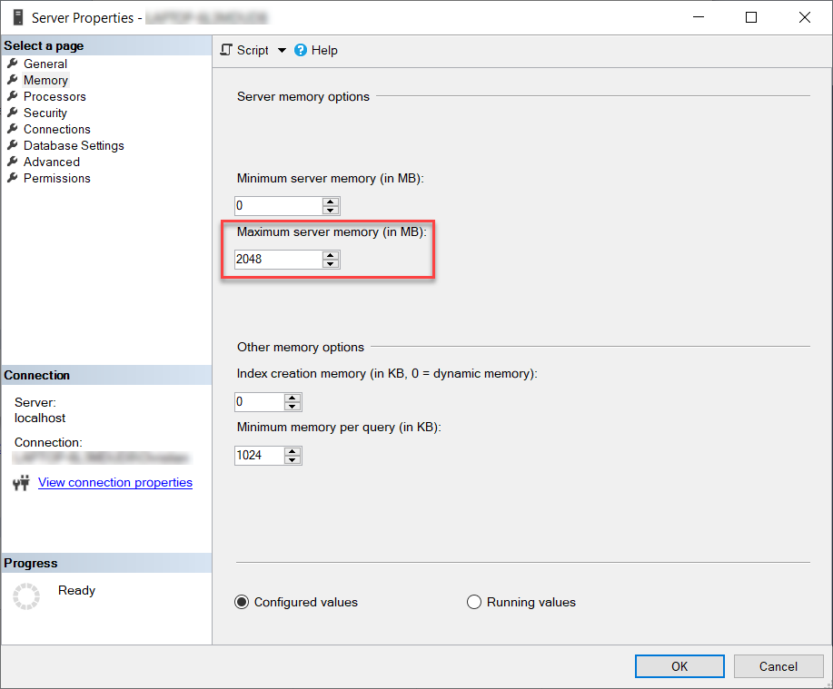

Microsoft SQL Server is made to use all the available memory in a server for itself. It will eat all the memory you throw at it. This can be a problem because your other applications may suffer performance problems as all the system memory is gone. To limit this behaviour you can limit the maximum amount of memory SQL is allowed to use.  

<!--endintro-->

1. Open SQL Server Management Studio<dl class="ssw15-rteElement-ImageArea">    Figure: SQL Server Management Studio - Login Screen</dl>
2. Right click on the server name and select “Properties”<dl class="ssw15-rteElement-ImageArea">     <strong>Figure: SQL Database options and properties menu</strong>  </dl>
3. Select the “Memory” tab <dl class="ssw15-rteElement-ImageArea">     <strong>Figure: Server Properties showing the ridiculously large value set for the maximum server memory</strong> </dl>
4. You will see that the default number is HUGE. Change this to something more realistic. Let SQL use half of the memory in your server.Leave about 1024MB headroom. For example, if you server has 4GB of RAM, give the SQL server a Maximum server memory of 2048mb.<dl class="ssw15-rteElement-ImageArea">     <strong>Figure: Maximum server memory settings in server properties</strong>  </dl>

 This will prevent SQL from “owning” all of the RAM on your system,leaving some memory left for your other applications to use.
