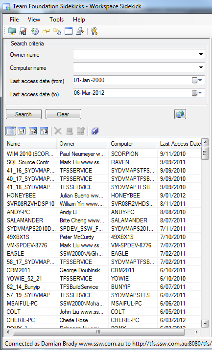

It is important to regularly do a "Get Latest" to make sure you are using the most recent version of the code. In a team, if you go too long without doing a Get, you are more likely to encounter inconsistencies and will have to spend time merging your code.
 <excerpt class='endintro'></excerpt> 

As part of your team process, you should make sure all developers are doing a Get Latest on a regular basis for each project they are working on.  This is in line with our <a href="/Pages/TestDrivenProcess.aspx">Do you Follow a Test Drive Process</a> rule.

Tip: To find out when you or another developer last did a Get from TFS, you can use the Workspace Sidekick in <a href="http://www.attrice.info/cm/tfs/index.htm">Team Foundation Sidekicks</a>. If you're the TFS Master, you should do this every couple of weeks to make sure your team is regularly retrieving files from TFS.

 

Figure: This report shows the last time each user did a Get from TFS 

