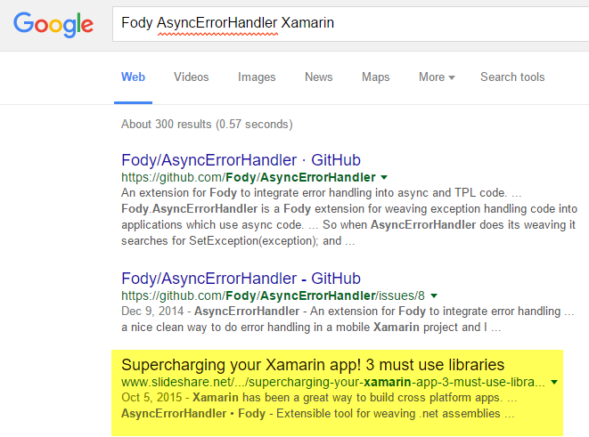
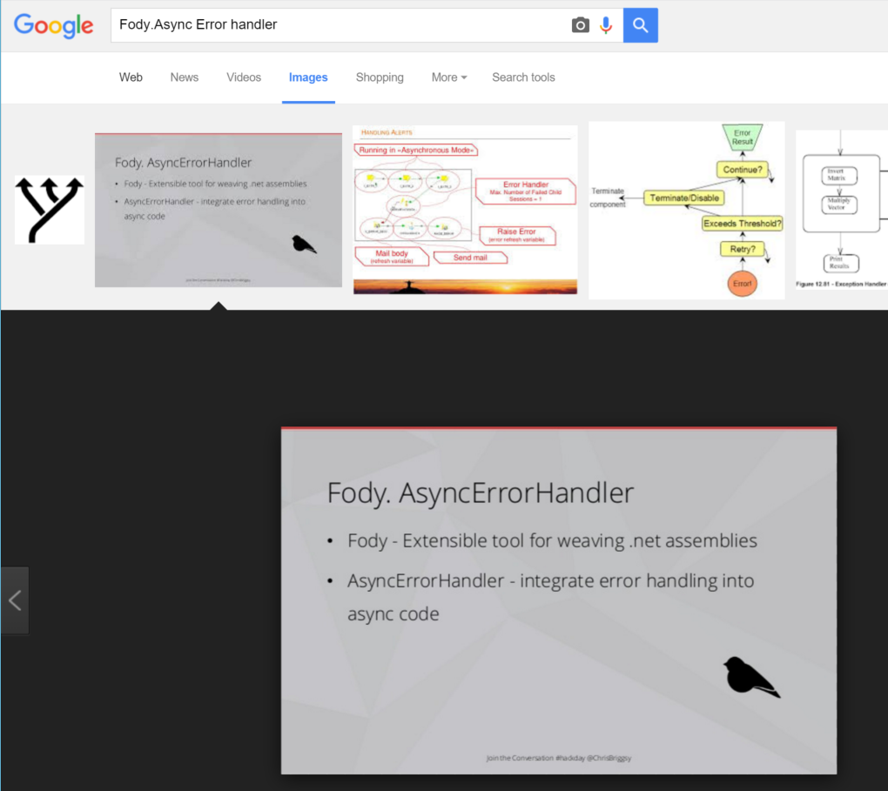
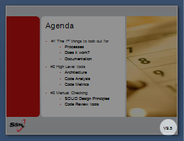
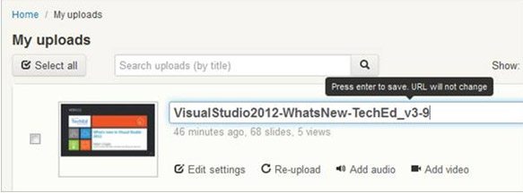
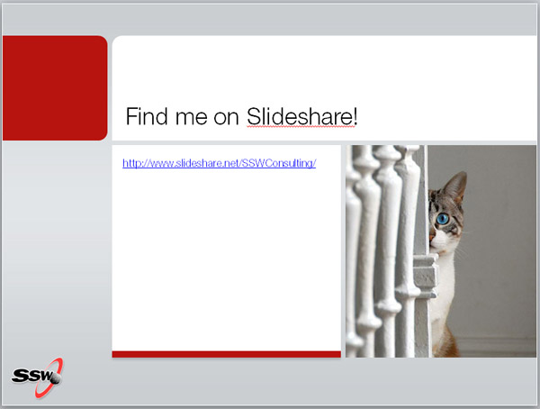
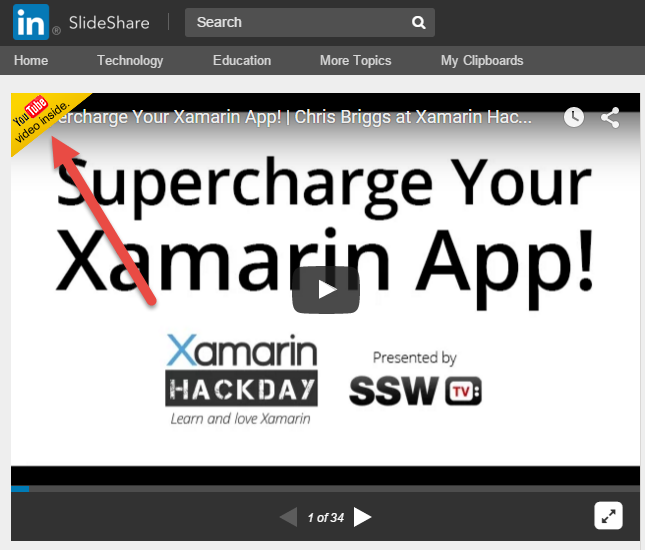

What is Slideshare? [Slideshare](http://www.slideshare.net/) is an online archive of presentations and other documents. It is the best way to store your training material for search engines and is easily accessible.

::: good
Slideshare ranks well in google searches
:::

::: good
Interestingly, keyword heavy slides from your PowerPoint will rank highly on Google Image Search
:::

Check out the slideshare shown above: '['Supercharging your Xamarin app! 3 must use libraries](http://www.slideshare.net/ChrisBriggsy/supercharging-your-xamarin-app-3-must-use-libraries)"

Follow these steps to ensure you get as much coverage as possible before and after your presentation.

<!--endintro-->

1. Prepare your PowerPoint as normal. Refer to [SSW Rules to Better Presentations.](/Pages/Rules-to-Better-Powerpoint-Presentations.aspx)
2. Work on your presentation from SharePoint to allow sharing.
3. Get your content checked by a tester and a designer (See our Rule: [Do you get someone to do a 'Test Please'?](/Pages/PPTTester.aspx))
4. Before you upload to Slideshare, add two slides:
    1. On the last slide, add a generic Slideshare link such as http://www.slideshare.net/YourAccount - E.g. http://www.Slideshare.net/SSWConsulting/
    2. On the first slide add a note that contains the version. This is so that you can compare easily what version is on SharePoint and what is on Slideshare

5. Upload to Slideshare – Make sure the title  **doesn’t** have the version number on it
6. Go to “My uploads” and change the presentation title to have the version number 
(after uploading) won’t affect the URL**
7. Create a "\_OnSlideshare.txt" file with the Slideshare URL and add it to SharePoint on the same folder where the original PPT is
8. Now you can present!
<dd class="ssw15-rteElement-FigureGood">
</dd>

::: good
Figure: the SSW example of a Slideshare link slide 
:::

 <b> </b> 

::: good
Figure: If you presentation is being recorded be sure to send yourself a reminder email to embedd the video in to the slideshare.

:::
