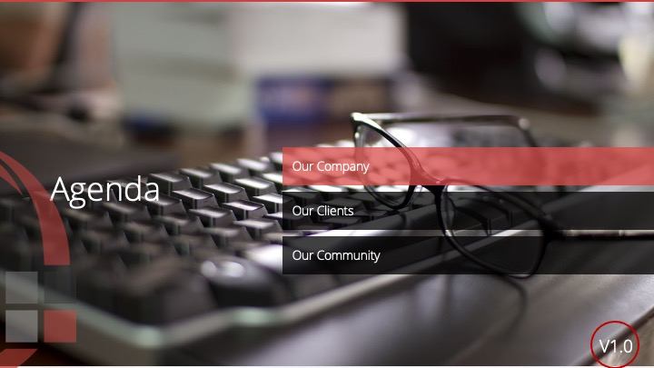
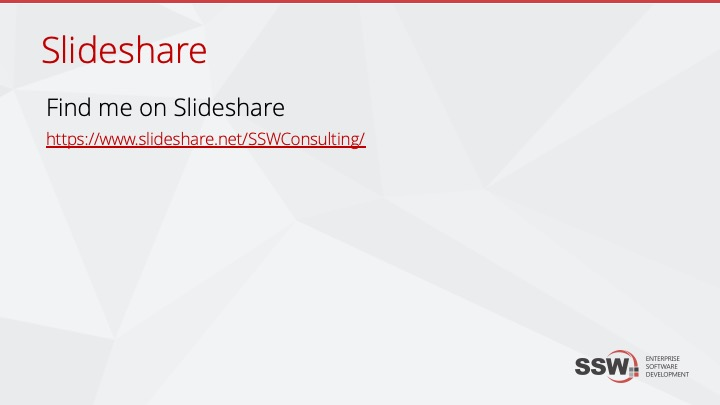

What is Slideshare? [Slideshare](http://www.slideshare.net/) is an online archive of presentations and other documents. It is the best way to store your training material for search engines and is easily accessible.

Check out the slideshare shown above: '['Supercharging your Xamarin app! 3 must use libraries](http://www.slideshare.net/ChrisBriggsy/supercharging-your-xamarin-app-3-must-use-libraries)"

Follow these steps to ensure you get as much coverage as possible before and after your presentation.

<!--endintro-->

1. Prepare your PowerPoint as normal. Refer to [SSW Rules to Better Presentations.](/rules-to-better-powerpoint-presentations)
2. Work on your presentation from SharePoint to allow sharing.
3. Get your content checked by a tester and a designer (See our Rule: [Do you get someone to do a 'Test Please'?](/do-you-get-your-ppt-tester-to-do-a-test-please-preferably-a-designer))
4. Before you upload to Slideshare, add two slides:
       1. On the last slide, add a generic Slideshare link such as http://www.slideshare.net/YourAccount - E.g. http://www.Slideshare.net/SSWConsulting/
       2. On the first slide add a note that contains the version. This is so that you can compare easily what version is on SharePoint and what is on Slideshare

   
5. Upload to Slideshare – Make sure the title  **doesn’t** have the version number on it
6. Go to “My uploads” and change the presentation title to have the version number
   **Figure: Adding the version number to the title (after uploading) won’t affect the URL**
7. Create a "_OnSlideshare.txt" file with the Slideshare URL and add it to SharePoint on the same folder where the original PPT is
8. Now you can present!

Don't want to use slideshare? There are some other options: [https://rules.ssw.com.au/do-you-keep-your-presentations-in-a-public-location](/do-you-keep-your-presentations-in-a-public-location)