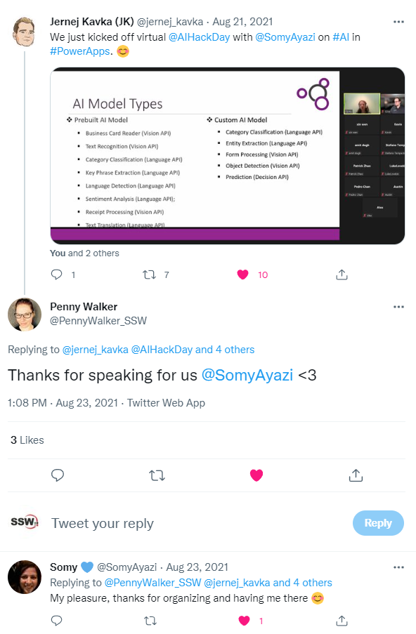

When others mention you on their blog or podcast and if they re-tweet you then you should always thank them.

<!--endintro-->

::: good
Figure: Good example, always thanking someone is not just good practice and polite, you both get Google juice as well
:::

Remember to say something constructive, and not just "thanks" to build on the engagement.