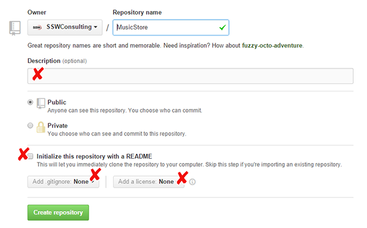
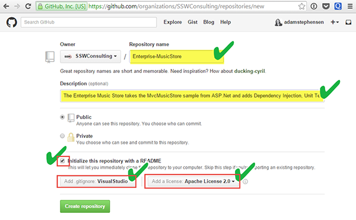

It is important when creating a new repository, to set it up correctly. Repositories without Descriptions, ReadMe files or licenses do not appear professionally built.
 <excerpt class='endintro'></excerpt> 
<dl class="badImage"><dt></dt><dd>Figure: Bad Example – Without the correct .gitIgnore, files that should not be included in the repository will be added. ​Without the correct license, your project will either be under-protected or over-protected</dd></dl><dl class="goodImage"><dt></dt><dd>Figure: Good Example – As well as a good repository name and description, a ReadMe, .gitignore and license will be included in the repository.​</dd></dl>

