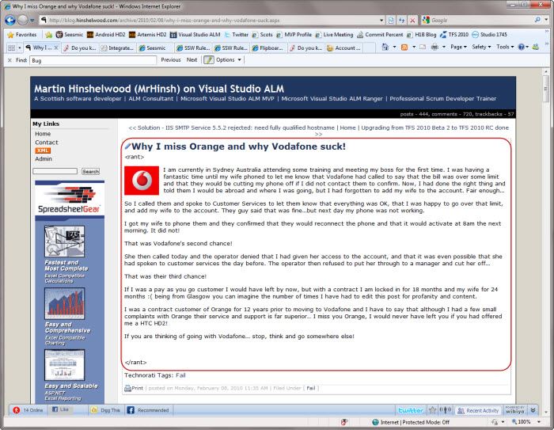
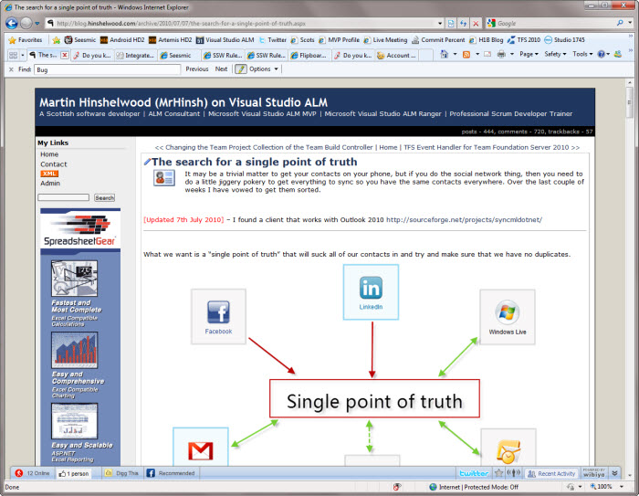

Probably the best reason to blog is when you have made a mistake, especially if you were pulled up for it by a peer. Post about the mistake you made, why you made it and how you are going to try and avoided it in the future. 

 <excerpt class='endintro'></excerpt> 

  
Turn a rant into a tip… 

 
Figure: Bad example – It is too easy to rant 

Figure: Good example – What started out as a rant about Plaxo became a tip on how to get round it 

