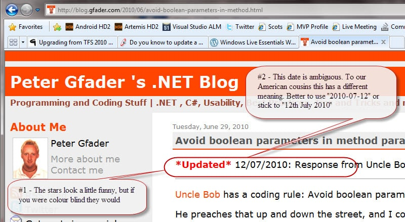
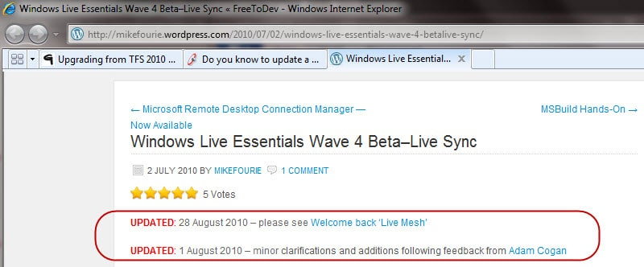
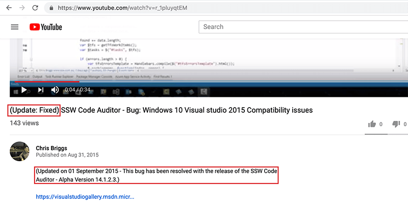

Use the word "UPDATED" clearly (in capitals and in red for example). The date should also be added if relevant.

<!--endintro-->

Example:

::: greybox
UPDATED: 1 August 2010 [what you changed]

:::

<dl class="image">&lt;dt&gt; 
       
   &lt;/dt&gt;<dd>Figure: OK example – Although Peter has the right idea, he needs to think more of a global audience - 
      <a href="http://blog.gfader.com/2010/06/avoid-boolean-parameters-in-method.html">See live</a></dd></dl><dl class="goodImage">&lt;dt&gt; 
       
   &lt;/dt&gt;<dd>Figure: Ultimate example – Mike has gotten into the swing of things - 
      <a href="http://mikefourie.wordpress.com/2010/07/02/windows-live-essentials-wave-4-betalive-sync/">See live</a></dd></dl>
You should also apply this technique to youtube videos you record.
<dl class="goodImage">&lt;dt&gt; 
       
   &lt;/dt&gt;<dd>Figure: Good Example - Following up on bug video makes it clear that the bug was fixed quickly </dd></dl>
### Related Rule

* [Do you explain why you've deleted or modified an appointment?](/_layouts/15/FIXUPREDIRECT.ASPX?WebId=3dfc0e07-e23a-4cbb-aac2-e778b71166a2&TermSetId=07da3ddf-0924-4cd2-a6d4-a4809ae20160&TermId=daaad5fc-870d-4cf1-8f4f-7d89a1b2c94d)
