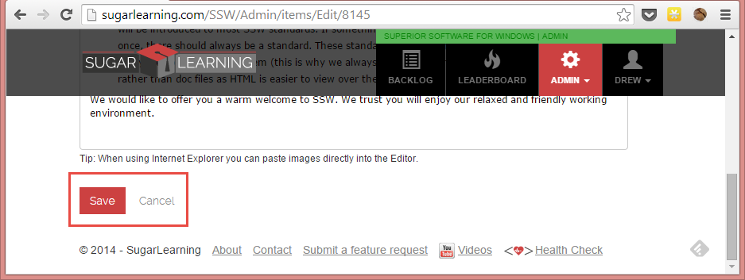
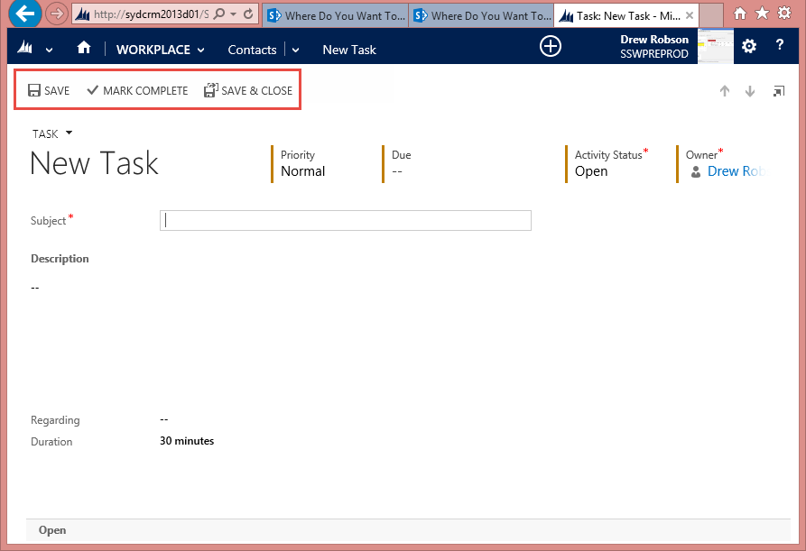

​​When the user is creating or editing data on a webpage, there are 2 buttons and one link you need to provide. 
 <excerpt class='endintro'></excerpt> 

​These three options are:
<ul><li>Save (button) - Saves the data and allows the user to keep editing </li><li>Save and Close (button) - Saves the data and returns to the previous screen</li><li>Cancel (link) - returns to the previous screen</li></ul>
 

 

<strong>Figure: Bad example - only provided <em>Save </em>button and <em>Cancel </em>link</strong>

 

 

<strong>Figure: Good example - CRM 2013 provides a </strong><em><strong>Save </strong></em><strong>button a</strong><strong>nd a <em>Save and Close</em> button</strong>

 

 

<strong>Figure: Better example - SugarLearning provides a <em>Save </em>button, a <em>Save and Close</em> button and a <em>Cancel </em>link</strong>

 

<strong>Further Reading:</strong>

<ul><li><strong style="line-height:20.8px;"><a href="/_layouts/15/FIXUPREDIRECT.ASPX?WebId=3dfc0e07-e23a-4cbb-aac2-e778b71166a2&TermSetId=07da3ddf-0924-4cd2-a6d4-a4809ae20160&TermId=e256302c-c486-4046-b202-a6b2020a5229">​​​SSW Rule - ​​Do you make your cancel button less obvious?​</a>​</strong> </li></ul>

