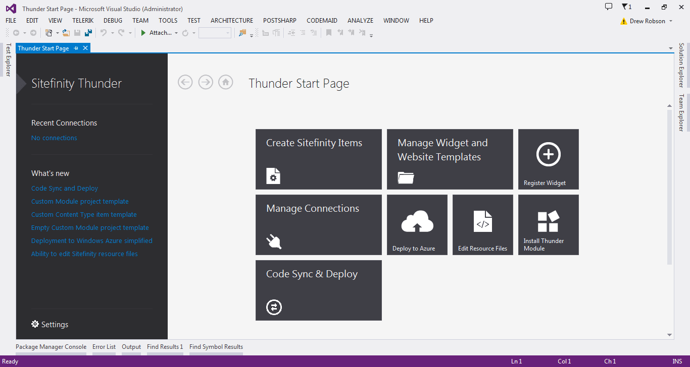
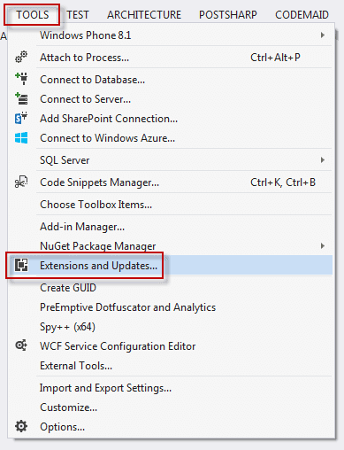
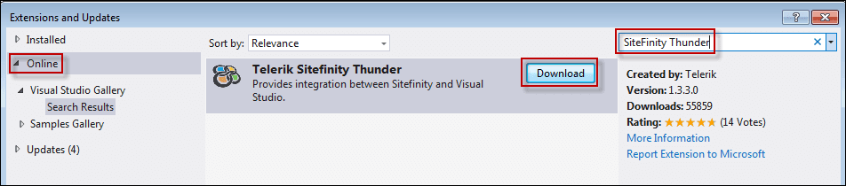
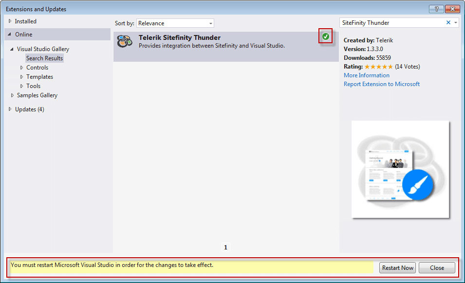

​​​​If you are working with Sitefinity, then use Sitefin​ity Thunder.
 <excerpt class='endintro'></excerpt> 

​

​Sitefi​nity Thunder integrates with Visual Studio and provides rich functionality to develop and deploy custom Sitefinity changes.

For example:
<ul><li>allows developers to automatically deploy custom code to multiple Sitefinity projects​ </li><li>accelerates custom development by connecting to Sitefinity instances inside Visual Studio. Once connected, Sitefinity Thunder supports a wide range of activities, including: modifying templates, deploying widgets, updating themes and much more </li><li>provides easy deployment to Azure through the Deploy to Azure wizard​</li></ul>
​ 

 

<strong>Figure:​ The Sitefinity Thunder dashboard</strong>

You can find out more at <a href="http://www.sitefinity.com/resources/tools/sitefinity-thunder">http://www.sitefinity.com/resources/tools/sitefinity-thunder​</a>.
<h3 class="ssw15-rteElement-H3">Installing Sitefinity Thunder​</h3>

It can be installed from Visual Studio | Tools | Extensions and Updates...

 

<strong>Figure: Add an extension to Visual Studio</strong>

 

 

<strong>Figure: Search for 'Sitefinity Thunder' in Extensions and Updates | Online</strong>

 

 

<strong>Figure: Once installation is completed, you'll be prompted to restart Visual Studio to use Sitefinity​ Thunder</strong>

Once Visual Studio is restarted, you'll be presented with the dashboard from top of this article.

