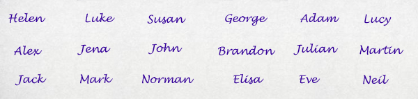

If the presenter has a small audience (say under 20), then it is best to know the attendee names (or at least quite a few of them) so you are able to communicate better with them throughout the day.

The problem is you will forget their names after they introduce themselves.

<!--endintro-->

The fix is to have a piece of paper, (already divided up) so you can write down the names on it in the order that people are sitting.

This ends up being a great reference you can use to address questions directly to participants using their name. This ensures that attendees keep focused as they may directly have questions referencing them.
<dl class="image">&lt;dt&gt;
   &lt;/dt&gt;<dd>Figure: For a classroom like this...</dd></dl><dl class="image">&lt;dt&gt;
   &lt;/dt&gt;<dd>Figure: ...use a sheet like this</dd></dl>
