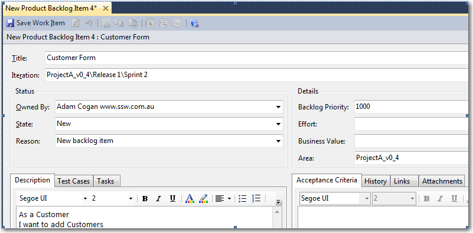

The role of the [PBI Owner](/tasks-do-you-know-that-every-user-story-should-have-an-owner) is like a mini project manager. The PBI Owner resolves any road blocks, performs the “[Test Please](/done-do-you-know-when-to-do-a-test-please-in-scrum)” and makes sure there is a good presentation at the Review Meeting. In addition having a PBI Owner makes it easy for Product Owners and others to talk to the right person.   
<!--endintro-->

There are five things that the story owner is responsible for:

* Manage / Own the story and its sub tasks
* Make sure a “[Test Please](/done-do-you-know-when-to-do-a-test-please-in-scrum)” is conducted (or that their story is included in one)
* Make every effort to show the story to the Product Owner before the Sprint Review (aka a [corridor conversation](/spec-do-you-conduct-a-specification-review-ask-for-a-coffee-not-a-marriage))
* Prepare for the Sprint Review. Make sure he ready for the review. Have a scribe, have a demo plan/script and get the story accepted quickly.
* Present the completed Story at the Sprint Review

Note: Make sure you are ready for the review. Have a scribe and how you are demoing worked out before hand.

The objective of the Review meeting is to have the story accepted quickly.

**Figure: Out of the box the Microsoft Scrum Template supports a ‘Story Owner’ via the ‘Owned By’ field**
