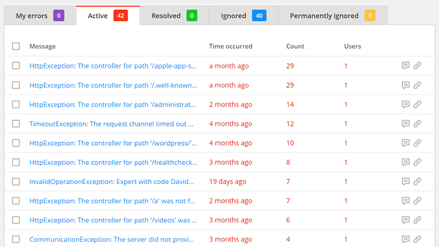
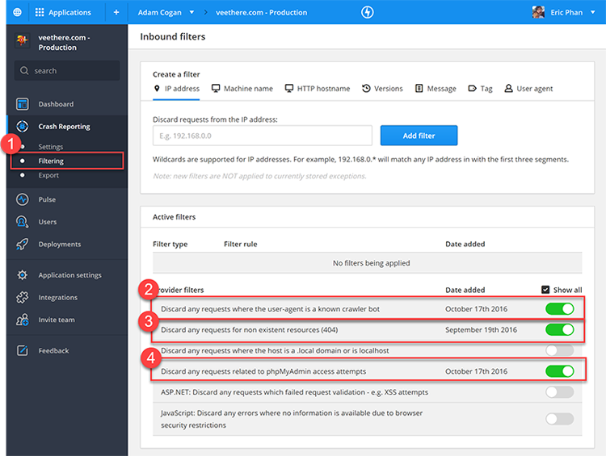
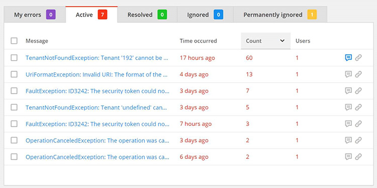

You should always keep on top of your RayGun crashreporting and not let the errors spiral out of control. If use RayGun with a web application, then you’ll frequently get a lot of errors with robots scanning the site and creating 404s.  

<!--endintro-->
<dl class="badImage">&lt;dt&gt;  &lt;/dt&gt;<dd>Figure: Bad Example – Most of these errors are 404s cause by automated tools scanning for vulnerabilities</dd>  </dl>
Luckily RayGun has built-in filtering to hide these frequent exceptions.
<dl class="image">&lt;dt&gt;  &lt;/dt&gt;</dl>
To enable filtering:

1. Under  **Crash Reporting** > select  **Filtering**
2. SSW recommends you turn on the following rules
    1. Discard any requesters where the user-agent is a known crawler bot
    2. Discard any request for non-existent resources (404)
    3. Discard any requests related to phpMyAdmin access attempts

Now you should have a nice clean crash report page with actual errors.
<dl class="goodImage">&lt;dt&gt;  &lt;/dt&gt;<dd>Figure: Good example – Now that the noise is gone, we can see the actual errors</dd></dl>
